# Implementation Plan 69: SYSTEM Sovereign Custodian — Multi-Tenant Fleet, RBAC & Custodial UI

Comprehensive full-stack implementation plan for the **`SYSTEM` Tenant (Sovereign Root Custodian)** across `@unipost/backend` (Spring Modulith / Java 21 / PostgreSQL 16+), `@unipost/console` (React 19 / Vite 8 / TanStack Router), and the **Unified Sandbox Platform**.

> **Direct Alignment Reference:** Strictly paired without discrepancy with [`docs/multi-tenants/11_system_tenant_sovereign_custody_architecture.md`](file:///c:/Users/Admin/workspace/git/unipost/docs/multi-tenants/11_system_tenant_sovereign_custody_architecture.md).

---

## 1. Architectural Baseline & Domain Context

### 1.1 The Sovereign Root Custodian (`SYSTEM`) vs. Commercial Tenants
- **Commercial Tenants (`tnt_...`)**: Bounded by PostgreSQL Row-Level Security (RLS) and JWT claims; consume inherited canonical schemas; subject to plan quotas.
- **Sovereign Custodian (`SYSTEM`)**: Universal platform anchor holding unconstrained quotas ($\infty$), total feature entitlements, cross-tenant observability, and decisive governance over schemas, quotas, tenants, and RBAC.

### 1.2 Invariant Quota Model (Option C Formulations)
1. **Workspace Quotas (Plan-Governed & Configurable)**:
   - Baseline quotas allocated per subscription tier:
     - `BASIC`: 1 Workspace
     - `PRO`: 5 Workspaces
     - `PRO_MAX`: 15 Workspaces
     - `ENTERPRISE`: Custom / Unlimited ($\infty$)
   - Centrally configurable in the pricing/catalog system by `SYSTEM`.
2. **Schema & Record Quotas (Sovereign Custodian Authority)**:
   - `maxSchemas` and `maxRecords` directly impact shared database memory, buffer pools, and noisy-neighbor health.
   - While plan defaults exist, **the `SYSTEM` Sovereign Custodian holds sole, decisive authority** to configure, override, or set custom thresholds (`maxSchemas`, `maxRecords`) per tenant or globally.

---

## 2. Six-Phase Implementation Roadmap

```mermaid
flowchart TD
    subgraph P1["Phase 1: DB & Backend Tenancy Core"]
        A1["Liquibase changelog-00006: Fix RLS Paradox"]
        A2["MetadataService: Caller-Aware Guard"]
        A3["TenantContextHolder: Dual-Context Principal"]
        A4["TenantSessionAspect: app.is_system_custodian"]
    end

    subgraph P2["Phase 2: Sovereign Control APIs & DTOs"]
        B1["SystemFleetController (/api/v1/system/*)"]
        B2["SystemFleetService & Tenant Entitlement Overrides"]
        B3["Assume-Tenant Ephemeral Token Generator"]
        B4["Fleet DTOs & Validation Schemas"]
    end

    subgraph P3["Phase 3: Unified Sandbox Parity"]
        C1["system-sandbox-handler.ts (Mock Fleet Store)"]
        C2["Register system persona in sandbox-store.ts"]
        C3["Zero-Network Mocking for /api/v1/system/*"]
    end

    subgraph P4["Phase 4: Dedicated UI Cockpits"]
        D1["Fleet Tenants Cockpit (/system/tenants)"]
        D2["Modals: CreateTenant, QuotaTuning, SubOverride, Suspend"]
        D3["RBAC & Permission Matrix Studio (/system/users/roles)"]
        D4["Persistent Assume-Tenant Warning Bar"]
    end

    subgraph P5["Phase 5: Navigation, Living Specs & i18n"]
        E1["sidebar-data.ts: Sovereign Custody group"]
        E2["ProfileSwitcher: Anchored Crown Section"]
        E3["ROUTE.md & DESIGN.md Sync (Amber Glass)"]
        E4["i18n (vi/console.json, en/console.json)"]
    end

    subgraph P6["Phase 6: Verification, Tests & Archival"]
        F1["Backend Tests: SystemFleetControllerTest, RlsParadoxTest"]
        F2["Console Vitest: Fleet & RBAC Cockpit Tests"]
        F3["History Log: 020_system_tenant_sovereign_custody.md"]
        F4["Conventional Git Commit"]
    end

    P1 --> P2 --> P3 --> P4 --> P5 --> P6
```

---

## 3. Detailed Phase Breakdown

### Phase 1: Database RLS Paradox Resolution & Backend Tenancy Core
1. **Database Migration (`apps/backend/unipost-db`)**:
   - Create Liquibase `changelog-000.000.00006.xml` and include in `changelog-master.xml`.
   - Update `tenant_isolation_entity_types`, `tenant_isolation_attribute_defs`, and `tenant_isolation_entities`:
     - Fix `WITH CHECK` to allow `SYSTEM` to write system schemas (`tenant_id = 'SYSTEM'`).
     - Grant `SYSTEM` read/audit access across the entire data plane.
2. **Metadata Engine Guard (`apps/backend/unipost-fw`)**:
   - Refactor `MetadataService.java`: Differentiate between commercial tenants and `SYSTEM`.
   - Allow callers with `tenant_id = 'SYSTEM'` to create, update, or delete system-level attributes and entity types.
3. **Dual-Context Principal (`TenantContextHolder.java`)**:
   - Introduce `actorTenantId` vs. `effectiveTenantId`.
   - Add helpers: `isImpersonating()`, `isSovereignActor()`.
4. **PostgreSQL Session Binding (`TenantSessionAspect.java`)**:
   - Set `SET LOCAL app.current_tenant_id` and conditionally `SET LOCAL app.is_system_custodian = 'true'`.

### Phase 2: Sovereign Control APIs, Fleet DTOs & Services
1. **REST Endpoints (`SystemFleetController.java`)**:
   - `GET /api/v1/system/tenants`: Paginated fleet listing with search, tier, status filters.
   - `POST /api/v1/system/tenants`: Provision new tenant organization with domain blueprint seeding.
   - `GET /api/v1/system/tenants/{id}`: Detailed fleet diagnostics (CPU, storage, quota telemetry).
   - `PUT /api/v1/system/tenants/{id}/status`: Soft kill-switch toggle (`ACTIVE` $\leftrightarrow$ `SUSPENDED`).
   - `PUT /api/v1/system/tenants/{id}/subscription`: Manual commercial tier promotion/downscale with feature flag cherry-picking.
   - `PUT /api/v1/system/tenants/{id}/quotas`: Injects custom quota overrides (`maxWorkspaces`, `maxSchemas`, `maxRecords`, `rateLimitBurst`).
   - `POST /api/v1/system/tenants/{id}/assume`: Generates ephemeral Assume-Tenant delegated session token.
   - `GET /api/v1/system/roles`: List system and custom RBAC roles with mapped permission atoms.
   - `PUT /api/v1/system/roles/{id}/permissions`: Update role permission bindings.
   - `GET /api/v1/system/users`: Universal cross-tenant user lookup.
   - `PUT /api/v1/system/users/{id}/lock`: Emergency credential lockdown.
2. **Backend Service (`SystemFleetService.java`)**:
   - Integrates with `TenantBillingRepository`, `TenantFeatureRepository`, and `TenantEntitlementService`.
   - Cluster-wide cache invalidation on subscription or quota updates.

### Phase 3: Unified Sandbox Platform Integration
1. **Sandbox Handler (`system-sandbox-handler.ts`)**:
   - Implements `SandboxRouteHandler` contract (`priority: 98`, matcher `/api/v1/system`).
   - Stateful in-memory `mockFleetStore` containing default seeded tenants (`tenant-acme`, `tenant-us-east-1`, `tenant-logistics`).
   - Supports live mutations: status toggling, quota lifts, subscription promotions, and Assume-Tenant token issuance.
   - Integrates with master `SandboxDock` reset event.
2. **Sandbox Store Persona (`sandbox-store.ts`)**:
   - Register `system` persona:
     - `id: 'system'`
     - `name: 'Sovereign Custodian (Me)'`
     - `roles: ['ROLE_USER', 'ROLE_ADMIN', 'ROLE_SYSTEM_CUSTODIAN']`
     - `defaultTenantId: 'SYSTEM'`
3. **API Client (`use-system-fleet.ts`)**:
   - TanStack Query hooks using `springApiClient`:
     - `useFleetTenants()`, `useFleetTenantDiagnostics(id)`
     - `useCreateTenant()`, `useUpdateTenantStatus()`, `useOverrideSubscription()`, `useUpdateTenantQuotas()`
     - `useAssumeTenant()`, `useSystemRoles()`, `useUpdateRolePermissions()`, `useGlobalUsers()`

### Phase 4: Dedicated Sovereign UI Cockpits
1. **Fleet Tenants Cockpit (`src/features/system/tenants/`)**:
   - `fleet-tenants-table.tsx`: Interactive multi-tenant ledger with live resource dials and telemetry.
   - `create-tenant-modal.tsx`: Organization provisioning modal with blueprint selector.
   - `subscription-override-drawer.tsx`: Manual commercial tier promotion and feature flag toggles.
   - `quota-tuning-drawer.tsx`: Sovereign sliders for `maxSchemas` and `maxRecords` (with **Unlimited $\infty$** toggle) and rate limits.
   - `suspend-tenant-dialog.tsx`: Emergency soft kill-switch modal requiring mandatory reason.
2. **RBAC & Permission Matrix Studio (`src/features/system/roles/`)**:
   - `rbac-matrix-grid.tsx`: Interactive matrix mapping categorized permission atoms to roles.
   - `role-definition-modal.tsx`: Custom role creation with SVG inheritance DAG.
   - `user-membership-drawer.tsx`: Cross-tenant user inspector with emergency session revocation.
3. **Assume-Tenant Warning Bar (`src/components/layout/assume-tenant-bar.tsx`)**:
   - Affixes to top of viewport during assumed sub-sessions with one-click exit button.

### Phase 5: Navigation, Living Specifications & i18n
1. **Navigation Rail (`sidebar-data.ts`)**:
   - Under `ROLE_SYSTEM_CUSTODIAN`, renders **Sovereign Custody** group (`Fleet Overview`, `Tenants Directory`, `Global Users & RBAC`, `Canonical Schemas`).
2. **Header Context Switcher (`ProfileSwitcher.tsx`)**:
   - Anchors top-level `👑 Sovereign Platform (SYSTEM)` section with fleet search (`Cmd+K`).
3. **Living Documentation Sync**:
   - `apps/console/ROUTE.md`: Add `/system/*` matrix rows and Section 3.8 screen blueprint.
   - `apps/console/DESIGN.md`: Add Amber Liquid Glass tokens (`--glass-amber-bg`, `--glass-amber-border`, `--glass-amber-specular`).
4. **Locale Synchronization**:
   - Add matching keys in `apps/console/src/locales/vi/console.json` and `en/console.json`.

### Phase 6: Verification, Test Suites & Git Archival
1. **Backend Tests**:
   - `SystemFleetControllerTest.java` (Endpoints, validation, security guards).
   - `SovereignCustodyAndRlsTest.java` (RLS bypass for SYSTEM, caller-aware metadata guard, quota overrides).
2. **Console Vitest Tests**:
   - `fleet-tenants.test.tsx` (Table rendering, filter actions, drawer triggers).
   - `rbac-matrix.test.tsx` (Matrix toggle interactions, permission inheritance).
   - `system-sandbox-handler.test.ts` (100% offline parity).
3. **Git Archival**:
   - Create sequential history log `docs/history/020_system_tenant_sovereign_custody.md`.
   - Update `docs/history/README.md`.
   - Auto-commit with Conventional Commits: `feat(system): sovereign custodian fleet management, rbac & custodial ui (phases 1-6)`.

---

## 4. Verification Checkpoints

| Checkpoint | Command | Target Criteria |
|---|---|---|
| **Backend Unit & Security** | `.\mvnw.cmd test -pl unipost-fw "-Dtest=*Fleet*,*Sovereign*,*Billing*"` | 100% Pass, 0 failures |
| **Frontend Test Suite** | `pnpm --filter @unipost/console test` | All tests pass, 0 regressions |
| **TypeScript Compilation** | `pnpm --filter @unipost/console exec tsc --noEmit` | Clean compilation, 0 errors |
| **Unified Sandbox Parity** | Toggle persona to `Sovereign Custodian (SYSTEM)` | Crown Mode renders; Fleet table loads mock tenants |
