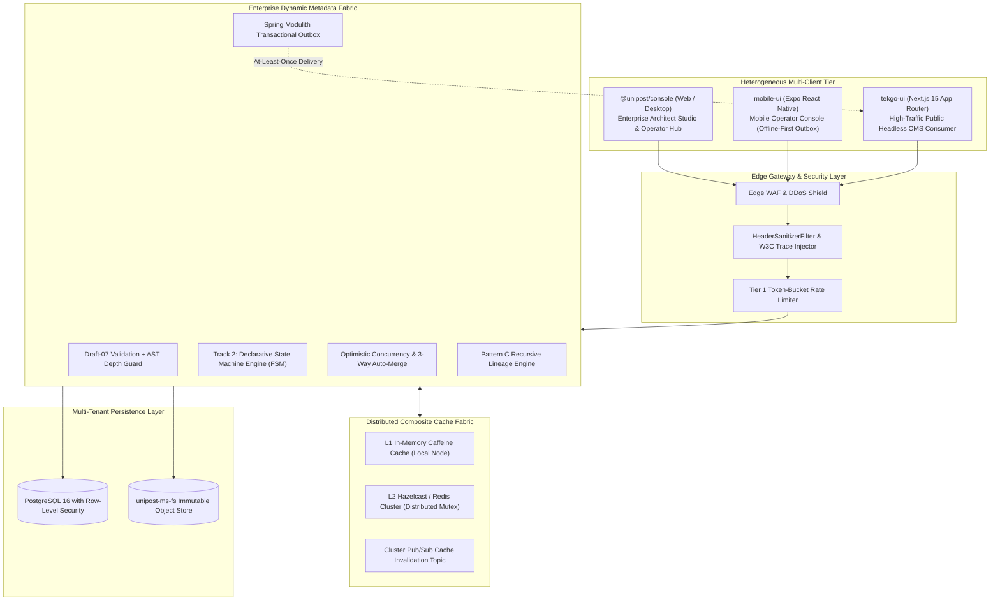
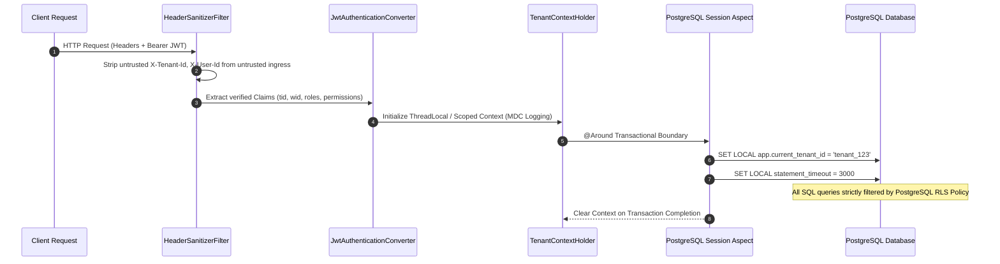
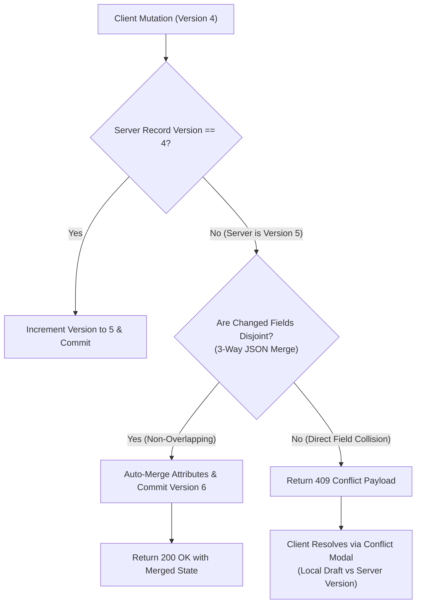
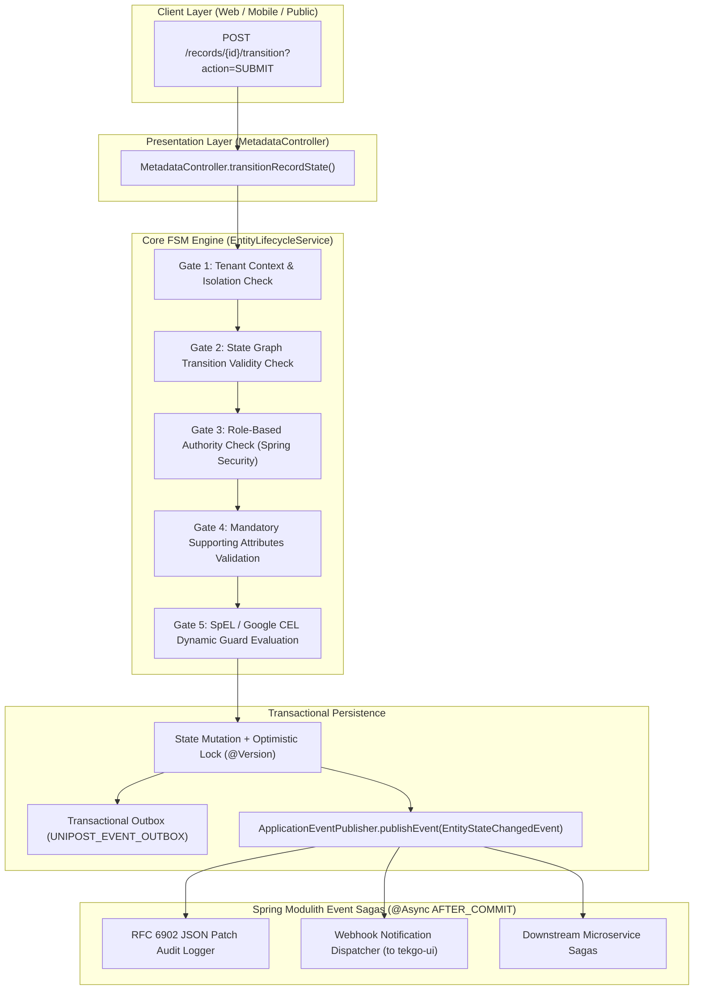
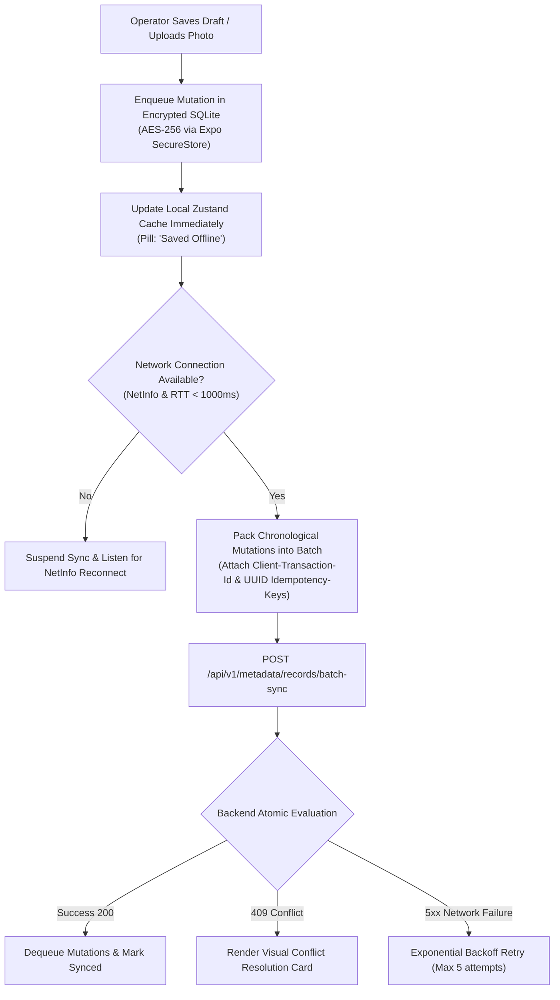
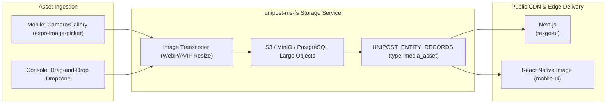
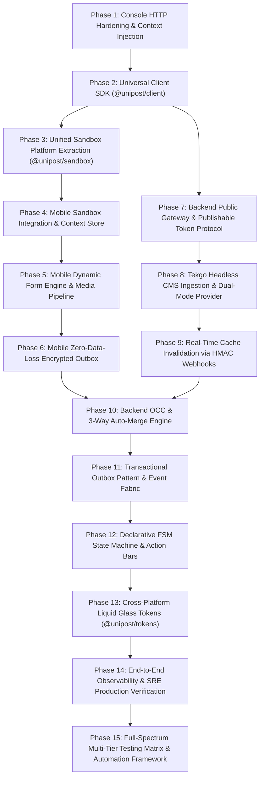

# Integration Master Plan (Iteration 1): Enterprise-Grade Multi-Tier Monorepo Strategy & Dynamic Metadata Fabric

> **Document Reference:** `docs/brainstorming/integration_master_plan_iteration_1.md`  
> **Iteration:** 1 (Enterprise Baseline)  
> **Classification:** Master Systems Architecture Specification & Monorepo Integration Standard  
> **Authors:** Lead Systems Architect & Full-Stack Engineering Team  
> **Target Scope:** `@unipost/backend`, `@unipost/console`, `@unipost/desktop`, `mobile-ui`, `tekgo-ui`, and `packages/*`  
> **Synthesized Authoritative Sources:**  
> - `docs/brainstorming/multi_tier_monorepo_alignment_blueprint.md`  
> - `docs/brainstorming/unlocking_full_potential_of_dynamic_metadata.md`  
> - `docs/brainstorming/track_2_declarative_state_machines_design.md`  
> - `docs/enterprise_transformation_blueprint.md`  
> - `docs/multi-tenants/11_system_tenant_sovereign_custody_architecture.md`

---

## 1. Executive Vision: The Converged Enterprise Platform

The Unipost platform unites high-throughput Java 21 / Spring Modulith backend micro-modules with a heterogeneous multi-client presentation tier (React 19 / Vite 8, Electrobun, Expo SDK 57 / React Native, and Next.js 15). 

To achieve **enterprise-grade reliability, multi-tenant fault isolation, and zero data loss**, the platform elevates **Dynamic Metadata** from an administrative tool into a mission-critical **Application Fabric**:



---

## 2. Zero-Trust Multi-Tenancy & Blast Radius Isolation

Enterprise platforms must guarantee that a malfunction, noisy neighbor, or security breach in Tenant A can never compromise Tenant B.

### 2.1 Three-Tier Multi-Tenant Context Pipeline
Every incoming HTTP request traverses a strict sanitization and context resolution ladder before reaching domain controllers:



### 2.2 Per-Tenant Dynamic Circuit Breakers & Resource Quotas
To prevent single-tenant cascading failures:
1. **Database Semaphore Quota**: PostgreSQL connections per tenant are capped via a distributed token bucket. A tenant saturating its concurrent connection pool receives an immediate HTTP `429 Too Many Requests` with a `Retry-After: 2` header, protecting sibling tenants.
2. **Schema Complexity & AST Depth Limiter**:
   - Maximum attribute definitions per entity: **128**.
   - Maximum JSON Schema nesting depth: **6 levels**.
   - Regex Validation Timeout: Worker execution capped at **50ms** via `InterruptibleCharSequence` to completely neutralize Regular Expression Denial of Service (ReDoS) attacks.
3. **Statement Execution Timeout**: All tenant transactions execute under `SET LOCAL statement_timeout = '3000ms'`. Runaway analytical queries are aborted before degrading write capacity.

---

## 3. Concurrency Control & Zero-Data-Loss Architecture

When mobile operators on cellular networks and desktop operators on broadband collaborate concurrently, collision is inevitable. The platform rejects naive "last-write-wins" semantics in favor of mathematical consistency.

### 3.1 Optimistic Concurrency Control (OCC) with 3-Way Auto-Merge

Every entity record in `UNIPOST_ENTITY_RECORDS` maintains a strict integer column `version` and `updated_date`:

```sql
UPDATE UNIPOST_ENTITY_RECORDS
SET attributes = :mergedAttributes,
    version = version + 1,
    updated_date = CURRENT_TIMESTAMP
WHERE id = :recordId
  AND tenant_id = :tenantId
  AND version = :expectedVersion;
```

#### Collision Resolution Engine
When `mobile-ui` or `@unipost/console` submits a mutation with an outdated version:



1. **Non-Overlapping Mutations**: If Operator A edited `attributes.title` while Operator B edited `attributes.tags`, the backend executes an automatic three-way merge, commits `version + 1`, and returns the merged document with the header `X-Merge-Status: auto-resolved`.
2. **True Attribute Collisions**: If both edited `attributes.body`, the backend returns `HTTP 409 Conflict` containing the full RFC 6902 conflict delta and server base state.

---

### 3.2 Transactional Outbox Pattern for Asynchronous Delivery

External notifications, webhook dispatches to `tekgo-ui`, and search indexing must **never execute directly within the database transaction**. If the network drops mid-HTTP call, the database either rolls back unnecessarily or the webhook is permanently lost.

#### Architectural Specification:
```sql
CREATE TABLE UNIPOST_EVENT_OUTBOX (
    id UUID PRIMARY KEY DEFAULT gen_random_uuid(),
    tenant_id VARCHAR(64) NOT NULL,
    event_type VARCHAR(128) NOT NULL,
    aggregate_id VARCHAR(64) NOT NULL,
    payload JSONB NOT NULL,
    headers JSONB NOT NULL,
    status VARCHAR(32) NOT NULL DEFAULT 'PENDING',
    retry_count INT NOT NULL DEFAULT 0,
    created_date TIMESTAMP WITH TIME ZONE DEFAULT CURRENT_TIMESTAMP,
    processed_date TIMESTAMP WITH TIME ZONE
);

CREATE INDEX idx_outbox_pending ON UNIPOST_EVENT_OUTBOX(status, created_date) WHERE status = 'PENDING';
```

1. **Atomic Write**: In `EntityRecordService.saveRecord()`, the record row and the `UNIPOST_EVENT_OUTBOX` entry are committed in the **identical ACID transaction**.
2. **Guaranteed Delivery Worker**: `unipost-ms-worker` polls `UNIPOST_EVENT_OUTBOX` using `SELECT ... FOR UPDATE SKIP LOCKED` and dispatches webhooks with exponential backoff ($2^n \times 500\text{ms}$, max 5 retries).
3. **Dead Letter Queue (DLQ)**: Failed dispatches transition to `DEAD_LETTER` with error stack traces, surfacing in the `@unipost/console` System Health panel for operator replay.

---

## 4. Cache Fabric Reliability & Cache Stampede Defense

In high-traffic environments, sudden traffic bursts (e.g. a viral post on `tekgo-ui`) can trigger cache stampedes (dogpiling) where thousands of requests bypass an expired cache and take down the database.

### 4.1 Probabilistic Early Expiration (XFetch Algorithm)
To guarantee that hot cache keys are regenerated **before** they expire:

$$\Delta t \propto -\beta \cdot \delta \cdot \ln(r)$$

Where:
- $\delta$ is the delta compute time required to query PostgreSQL.
- $\beta > 0$ is an aggressiveness constant ($\beta = 1.0$).
- $r \sim \text{Uniform}(0, 1)$ is a pseudo-random value.

When a reader accesses a cache key within its revalidation threshold, a single request triggers a background cache refresh while all current readers receive instantaneous cached responses.

### 4.2 Distributed Mutex (`FencedLock`) for L2 Cache Regeneration
If a cold cache miss occurs, the backend acquires a distributed Hazelcast `FencedLock`:

```java
// apps/backend/unipost-fw/src/main/java/com/unipost/cache/ResilientCacheManager.java
public CompiledSchema getCompiledSchema(String tenantId, String entityTypeId) {
    String cacheKey = CompositeCacheKey.of(tenantId, entityTypeId);
    CompiledSchema cached = l1Cache.get(cacheKey);
    if (cached != null) return cached;

    cached = l2HazelcastMap.get(cacheKey);
    if (cached != null) {
        l1Cache.put(cacheKey, cached);
        return cached;
    }

    // Acquire Distributed Mutex to prevent DB dogpiling
    FencedLock lock = hazelcastInstance.getCPSubsystem().getLock("lock:" + cacheKey);
    if (lock.tryLock(500, TimeUnit.MILLISECONDS)) {
        try {
            // Double-check after lock acquisition
            cached = l2HazelcastMap.get(cacheKey);
            if (cached != null) return cached;

            CompiledSchema fresh = compileFromDatabase(tenantId, entityTypeId);
            l2HazelcastMap.put(cacheKey, fresh, 60, TimeUnit.MINUTES);
            l1Cache.put(cacheKey, fresh);
            return fresh;
        } finally {
            lock.unlock();
        }
    } else {
        // Fallback: return stale cache or wait briefly
        return l2HazelcastMap.getOrDefault(cacheKey, FallbackSchema.EMPTY);
    }
}
```

---

## 5. Declarative Finite State Machine (FSM) & Workflow Engine (Track 2 Deep-Dive)

Synthesizing the complete architecture from [`docs/brainstorming/track_2_declarative_state_machines_design.md`](file:///c:/Users/Admin/workspace/git/unipost/docs/brainstorming/track_2_declarative_state_machines_design.md), dynamic records are elevated into **stateful domain entities with deterministic lifecycles**.



### 5.1 Database Model & Schema Specification
`UNIPOST_ENTITY_TYPES` is extended with a JSONB column `lifecycle_config`:

```sql
-- Liquibase changeset migration definition
ALTER TABLE UNIPOST_ENTITY_TYPES
ADD COLUMN lifecycle_config JSONB DEFAULT NULL;

COMMENT ON COLUMN UNIPOST_ENTITY_TYPES.lifecycle_config IS
'JSONB schema storing state machine definitions, initial state, states list, transition rules, required attributes, allowed roles, and guard expressions';
```

#### JSON Schema Specification for `lifecycle_config`
```json
{
  "$schema": "http://json-schema.org/draft-07/schema#",
  "title": "LifecycleConfigSchema",
  "type": "object",
  "properties": {
    "state_field": {
      "type": "string",
      "default": "status",
      "description": "Attribute key in entity attributes map that holds the state value"
    },
    "initial_state": {
      "type": "string",
      "description": "Initial state automatically set on creation if state_field is omitted"
    },
    "states": {
      "type": "array",
      "items": { "type": "string" },
      "minItems": 1,
      "description": "Exhaustive list of valid states in this state machine"
    },
    "transitions": {
      "type": "array",
      "items": {
        "type": "object",
        "properties": {
          "from": {
            "type": "string",
            "description": "Source state identifier or '*' for wildcard match"
          },
          "to": {
            "type": "string",
            "description": "Destination state identifier"
          },
          "action": {
            "type": "string",
            "description": "Trigger action name (e.g., SUBMIT, APPROVE, REJECT, ARCHIVE)"
          },
          "required_attributes": {
            "type": "array",
            "items": { "type": "string" },
            "description": "Attributes that MUST be present and non-null in attributes before transitioning"
          },
          "guard_expression": {
            "type": "string",
            "description": "SpEL/CEL expression evaluated against attributes map returning boolean"
          },
          "allowed_roles": {
            "type": "array",
            "items": { "type": "string" },
            "description": "Spring Security GrantedAuthority role names permitted to invoke transition"
          }
        },
        "required": ["from", "to", "action"]
      }
    }
  },
  "required": ["state_field", "initial_state", "states", "transitions"]
}
```

### 5.2 The 5-Gate Sequential Validation Engine
When a transition is requested, `EntityLifecycleService` evaluates five sequential gates:
1. **Gate 1: Tenant Context Isolation Gate**: Asserts `record.tenantId.equals(TenantContextHolder.getTenantId())`.
2. **Gate 2: State Graph Transition Validity Gate**: Matches `action` and ensures `from == currentState` or `from == '*'`. Throws `MetadataConflictException` on invalid trajectory.
3. **Gate 3: Role-Based Authority Gate**: Verifies caller `Authentication.getAuthorities()` contains at least one of `allowed_roles`.
4. **Gate 4: Required Attribute Presence Gate**: Asserts every key in `required_attributes` is present and non-empty.
5. **Gate 5: Dynamic Guard Expression Gate**: Evaluates `guard_expression` via `GuardEvaluatorStrategy`.

### 5.3 Strategy Pattern for Guard Evaluators
```java
public interface GuardEvaluatorStrategy {
    boolean evaluate(String guardExpression,
                     Map<String, Object> attributes,
                     Authentication authentication,
                     String tenantId,
                     String oldState,
                     String newState);
}
```
Available implementations: `SpelGuardEvaluatorStrategy` (default Spring SpEL with expression caching) and `CelGuardEvaluatorStrategy` (Google Common Expression Language for cloud portability).

### 5.4 Domain Event Sagas & Decoupled Execution
Upon successful transition, the engine dispatches `EntityStateChangedEvent`:
```java
public record EntityStateChangedEvent(
    String tenantId,
    Long entityTypeId,
    Long recordId,
    String oldState,
    String newState,
    String action,
    String triggeredBy,
    Map<String, Object> attributesSnapshot,
    Instant timestamp
) {}
```
Spring Modulith transactional listeners react to the event:
- **Audit Logger**: Writes RFC 6902 JSON patch to `UNIPOST_ENTITY_AUDIT_LOGS`.
- **Outbox Publisher**: Inserts into `UNIPOST_EVENT_OUTBOX` for webhook delivery to `tekgo-ui`.

---

## 6. Mobile Operator Console: Zero-Data-Loss Engine (`mobile-ui`)

Mobile operators operate in transit over unreliable cellular networks. The `mobile-ui` client guarantees zero data loss through an offline-first, encrypted outbox architecture.



### 6.1 Native Schema-Driven Dynamic Form Engine
```typescript
// apps/mobile-ui/src/components/dynamic-form/DynamicFieldRenderer.tsx
export const DynamicFieldRenderer: React.FC<DynamicFieldProps> = ({ attribute, value, onChange, error }) => {
  switch (attribute.dataType) {
    case 'STRING':
      return <GlassTextInput label={attribute.displayName} value={value ?? ''} onChangeText={onChange} />;
    case 'BOOLEAN':
      return <GlassToggleRow label={attribute.displayName} value={Boolean(value)} onValueChange={onChange} />;
    case 'MEDIA_ASSET':
      return <MediaPickerInput label={attribute.displayName} mediaUrl={value} onUploadComplete={onChange} />;
    case 'RELATION_PICKER':
      return <RelationPickerBottomSheet targetEntityType={attribute.targetEntityType!} selectedId={value} onSelect={onChange} />;
    default:
      return <GlassTextInput label={attribute.displayName} value={String(value ?? '')} onChangeText={onChange} />;
  }
};
```

### 6.2 Mobile FSM Lifecycle Action Bar
```typescript
// apps/mobile-ui/src/components/lifecycle/RecordLifecycleActionBar.tsx
export const RecordLifecycleActionBar = ({ record, entityType, onTransition }) => {
  const currentStatus = record.attributes.status || 'DRAFT';
  const transitions = entityType.lifecycleConfig?.transitions.filter((t) => t.from === currentStatus) || [];
  if (transitions.length === 0) return null;

  return (
    <View className="flex-row gap-3 p-4 bg-white/40 dark:bg-slate-900/40 backdrop-blur-xl border-t border-white/20">
      {transitions.map((t) => (
        <GlassButton key={t.action} variant={t.action === 'REJECT' ? 'destructive' : 'primary'} onPress={() => onTransition(t.action)}>
          {t.action}
        </GlassButton>
      ))}
    </View>
  );
};
```

---

## 7. Public Ingestion Gateway & Security for `tekgo-ui` (Blog Website)

`tekgo-ui` is a public-facing storefront. It must be resilient against scrapers, DDoS attacks, and API key leaks.

### 7.1 Cryptographic Publishable Token Architecture
To read published articles without passing sensitive credentials:
1. **Publishable Token**: `pk_live_{tenantSlug}_{sha256Hex}` is embedded into Next.js environment configurations.
2. **Read-Only Scope Enforcement**: The backend gateway strictly permits `SELECT` operations on records flagged with `status = 'PUBLISHED'`. Any attempt to invoke mutations, read drafts, or access private models yields `HTTP 403 Forbidden`.
3. **Rate Limiting**: Public endpoints enforce a strict token-bucket rate limit (**100 req/sec per IP**, **2000 req/sec aggregate per tenant**).

### 7.2 Signed Webhook Protocol with Timestamp Replay Protection
When an article is published from Console or Mobile, `unipost-ms-worker` delivers an HMAC-SHA256 signed payload to `tekgo-ui`:

$$\text{Signature} = \text{HMAC-SHA256}(\text{Secret}, \text{Timestamp} + "." + \text{Payload})$$

```typescript
// apps/tekgo-ui/app/api/revalidate/route.ts
export async function POST(req: NextRequest) {
  const signature = req.headers.get('x-unipost-signature');
  const timestamp = req.headers.get('x-unipost-timestamp');
  const secret = process.env.UNIPOST_WEBHOOK_SECRET!;

  // 1. Prevent Replay Attacks (Reject requests older than 300 seconds)
  const currentTime = Math.floor(Date.now() / 1000);
  if (!timestamp || Math.abs(currentTime - parseInt(timestamp, 10)) > 300) {
    return NextResponse.json({ error: 'Replay window expired' }, { status: 401 });
  }

  // 2. Cryptographic Signature Validation
  const rawBody = await req.text();
  const expectedSig = crypto.createHmac('sha256', secret).update(`${timestamp}.${rawBody}`).digest('hex');

  if (signature !== expectedSig) {
    return NextResponse.json({ error: 'Invalid HMAC signature' }, { status: 401 });
  }

  const { slug, tag } = JSON.parse(rawBody);
  if (slug) revalidatePath(`/blog/${slug}`);
  if (tag) revalidateTag(tag);
  revalidatePath('/blog');

  return NextResponse.json({ revalidated: true, timestamp: Date.now() });
}
```

---

## 8. Media & Asset Pipeline (`unipost-ms-fs`)

Binary assets (post hero images, attachments, author avatars) follow an immutable storage lifecycle:



---

## 9. Multi-Platform Liquid Glass Token Engine & WCAG 2.2 AA Parity

```typescript
// Proposed: packages/tokens/src/glass.ts
export const LiquidGlassTokens = {
  blur: {
    xs: 4,
    sm: 8,
    md: 16,
    lg: 24,
    xl: 32,
    xxl: 48,
  },
  scrim: {
    ultraLight: { light: 'rgba(255, 255, 255, 0.40)', dark: 'rgba(15, 23, 42, 0.40)' },
    standard:   { light: 'rgba(255, 255, 255, 0.65)', dark: 'rgba(15, 23, 42, 0.65)' }, // WCAG 2.2 AA compliant
    highContrast:{ light: 'rgba(255, 255, 255, 0.85)', dark: 'rgba(15, 23, 42, 0.85)' },
  },
  borders: {
    specularLight: 'rgba(255, 255, 255, 0.35)',
    specularDark:  'rgba(255, 255, 255, 0.12)',
    insetHighlight:'rgba(255, 255, 255, 0.40)',
  },
  elevation: {
    flat:    'none',
    card:    '0 8px 32px 0 rgba(0, 0, 0, 0.08)',
    modal:   '0 16px 48px 0 rgba(0, 0, 0, 0.16)',
    floating:'0 24px 64px 0 rgba(0, 0, 0, 0.24)',
  },
} as const;
```

---

## 10. Monorepo Shared Package Topology (`packages/*`)

```
packages/
├── client/ (@unipost/client)
│   ├── DTO Interfaces (Metadata, Records, Blueprints, Billing, Auth, FSM)
│   ├── Universal Fetch Client with W3C Trace Injection & 401 Refresh
│   ├── 3-Way Auto-Merge Client Engine & OCC Conflict Wrappers
│   └── Typed Error Payloads (RFC 7807 ProblemDetail)
├── sandbox/ (@unipost/sandbox)
│   ├── Unified Sandbox Engine & Registry
│   ├── Built-in Handlers: Auth, Metadata, Users, Tasks, Billing
│   ├── Mobile Sandbox Adapter (Zero hardcoded mocks)
│   └── Stateful Reset & Persona Switching Utilities
├── tokens/ (@unipost/tokens)
│   ├── OKLCH Color Scales & Semantic Scrims
│   ├── Liquid Glass Metrics (Blur, Borders, Insets, Elevation)
│   └── Cross-Platform Exports for Tailwind v4 and React Native StyleSheet
├── ui/ (@unipost/ui)
│   ├── Web Liquid Glass Components (Buttons, Modals, Cards, Popovers)
│   └── Headless Renderers: <DynamicEntityForm /> & <DynamicDataGrid />
└── i18n/ (@unipost/i18n)
    └── Centralized Translation Dictionaries (locales/en, locales/vi)
```

---

## 11. Granular Deep-Dive Implementation Roadmap (15 Phases)



---

### Phase 1: `@unipost/console` HTTP Hardening & Context Injection
- **Objective:** Eliminate rogue global `axios` calls in `@unipost/console` and unify context header propagation.
- **Affected Files:**
  - `apps/console/src/features/metadata/api/use-blueprints.ts`
  - `apps/console/src/features/metadata/api/use-billing.ts`
  - `apps/console/src/features/spring-auth/api-client.ts`
- **Technical Design:**
  - Route all Blueprint and Billing queries through `springApiClient`.
  - Add request interceptor in `spring-auth/api-client.ts` injecting `X-Tenant-Id` and `X-Workspace-Id` from `useMetadataUiStore.getState()`.
  - Standardize response unwrapping: `unwrapResponse(data) => data?.body ?? data?.data ?? data`.
- **Verification Gates:** `pnpm --filter @unipost/console test` passes (91/91 tests); zero `import axios from 'axios'` in `features/metadata/api/`.

---

### Phase 2: Universal Client SDK (`packages/client`)
- **Objective:** Extract typed DTOs and universal HTTP client into a shared monorepo package.
- **Affected Packages:**
  - Create `packages/client/package.json`, `packages/client/src/index.ts`
  - Migrate DTOs from `apps/console/src/features/metadata/api/types.ts`
- **Technical Design:**
  - Universal `UnipostClient` relying on standard `fetch` with W3C `traceparent` generator.
  - Export domain interfaces: `EntityType`, `AttributeDefinition`, `EntityRecord`, `BlueprintManifest`, `TenantBillingSummary`, `CheckoutResponse`, `ProblemDetail`.
- **Verification Gates:** `pnpm --filter @unipost/client test` passes with 100% coverage; Console builds cleanly (`tsc -b`).

---

### Phase 3: Unified Sandbox Platform Extraction (`packages/sandbox`)
- **Objective:** Extract the Unified Sandbox engine from `@unipost/console` to allow multi-client usage.
- **Affected Packages:**
  - Create `packages/sandbox/`
  - Move core logic from `apps/console/src/core/sandbox/`
- **Technical Design:**
  - Export `SandboxRegistry`, `createSandboxHandler`, `SandboxRouteHandler`.
  - Implement both `AxiosSandboxAdapter` (Console) and `FetchSandboxAdapter` (Mobile & Tekgo).
- **Verification Gates:** Console sandbox tests pass using extracted package with zero regressions.

---

### Phase 4: `mobile-ui` Sandbox Integration & Context Store
- **Objective:** Bring `mobile-ui` into 100% compliance with `.agents/rules/02-unified-sandbox.md`.
- **Affected Files:**
  - Delete `apps/mobile-ui/src/constants/mockData.ts`
  - Refactor `apps/mobile-ui/src/store/usePostStore.ts`
  - Create `apps/mobile-ui/src/store/useMobileContextStore.ts`
- **Technical Design:**
  - In `apps/mobile-ui/src/navigation/RootNavigator.tsx`, initialize `attachSandboxFetchInterceptor()`.
  - Replace hardcoded post mutations with `unipostClient.request('/v1/metadata/records?entityType=post')`.
- **Verification Gates:** `mobile-ui` displays feed from Sandbox handler; stateful reset functions; zero rogue mocks.

---

### Phase 5: `mobile-ui` Dynamic Form Engine & Media Pipeline
- **Objective:** Enable mobile operators to create/edit records for any entity model with photo uploads.
- **Affected Files:**
  - Create `apps/mobile-ui/src/components/dynamic-form/DynamicFieldRenderer.tsx`
  - Create `apps/mobile-ui/src/components/dynamic-form/MediaPickerInput.tsx`
  - Create `apps/mobile-ui/src/components/dynamic-form/RelationPickerBottomSheet.tsx`
- **Technical Design:**
  - Maps `CompiledSchema` properties to React Native inputs with Liquid Glass styling.
  - Integrates `expo-image-picker` with client-side JPEG/WebP compression (max 1920px, 85% quality).
  - Streams binary to `unipost-ms-fs` via `/fs/objects/upload`, returns immutable content URI.
- **Verification Gates:** Dynamic form renders inputs conforming to entity's JSONSchema; selected image uploads and attaches URL.

---

### Phase 6: `mobile-ui` Zero-Data-Loss Encrypted Outbox (`useOutboxStore`)
- **Objective:** Guarantee zero data loss for mobile operators working on intermittent cellular networks.
- **Affected Files:**
  - Create `apps/mobile-ui/src/store/useOutboxStore.ts`
  - Create `apps/mobile-ui/src/components/conflict/ConflictResolutionModal.tsx`
- **Technical Design:**
  - Persists pending RFC 6902 mutations in SQLCipher / encrypted AsyncStorage with keys from `Expo.SecureStore`.
  - Attaches `Client-Transaction-Id` and per-mutation idempotency UUIDs.
  - Dispatches sync batches on network reconnect via `NetInfo`.
- **Verification Gates:** Airplane mode simulation: edit record $\to$ restart $\to$ reconnect $\to$ mutations commit cleanly.

---

### Phase 7: Backend Public Ingestion Gateway & Publishable Key Protocol
- **Objective:** Allow public readers on `tekgo-ui` to read published content safely without credentials.
- **Affected Files:**
  - `apps/backend/unipost-fw/src/main/java/com/unipost/presentation/PublicCmsGatewayController.java`
  - `apps/backend/unipost-fw/src/main/java/com/unipost/security/PublishableKeyFilter.java`
- **Technical Design:**
  - Generates scoped publishable keys: `pk_live_{tenantSlug}_{hash}`.
  - Exposes `GET /api/v1/public/tenants/{tenantId}/cms/records?entityType=article`.
  - Enforces `WHERE status = 'PUBLISHED' AND deleted_date IS NULL` under tenant RLS.
- **Verification Gates:** Public request fetches published articles; accessing draft article returns HTTP 404/403.

---

### Phase 8: `tekgo-ui` Headless CMS Ingestion & Dual-Mode Provider
- **Objective:** Transform `tekgo-ui` into a live consumer of the backend Headless CMS blueprint.
- **Affected Files:**
  - Create `apps/tekgo-ui/lib/cms/unipost-cms-client.ts`
  - Create `apps/tekgo-ui/lib/cms/content-provider.ts`
  - Refactor `apps/tekgo-ui/app/blog/page.tsx` & `apps/tekgo-ui/app/blog/[...slug]/page.tsx`
- **Technical Design:**
  - Dual-mode data toggle: `DATA_SOURCE=cms | local`.
  - Queries public gateway using Next.js 15 `fetch(..., { next: { tags: ['articles'], revalidate: 60 } })`.
- **Verification Gates:** Next.js build succeeds with live/mock CMS articles; fallback works in local mode.

---

### Phase 9: Real-Time Edge Invalidation via HMAC Signed Webhooks
- **Objective:** Instantaneously update `tekgo-ui` reader views when an article is published.
- **Affected Files:**
  - `apps/backend/unipost-ms-worker/src/main/java/com/unipost/worker/service/WebhookDeliveryService.java`
  - Create `apps/tekgo-ui/app/api/revalidate/route.ts`
- **Technical Design:**
  - Outbound webhook with `x-unipost-signature: HMAC-SHA256(secret, timestamp + "." + body)`.
  - `tekgo-ui` validates signature, rejects requests older than 300s, and invokes `revalidatePath('/blog/[...slug]')`.
- **Verification Gates:** Publishing in Console/Mobile triggers webhook; Next.js invalidates cache within 500ms.

---

### Phase 10: Backend OCC & 3-Way Auto-Merge Engine
- **Objective:** Eliminate silent data overwrites (last-write-wins) during concurrent edits.
- **Affected Files:**
  - `apps/backend/unipost-fw/src/main/java/com/unipost/service/EntityRecordService.java`
  - `apps/backend/unipost-db/src/main/resources/db/migration/V..._add_occ_version.sql`
- **Technical Design:**
  - Adds integer `version` and `updated_date` columns to `UNIPOST_ENTITY_RECORDS`.
  - In `updateEntityRecord()`, checks `WHERE id = :id AND version = :expectedVersion`.
  - Executes 3-way auto-merge for disjoint attribute mutations; returns HTTP 409 on true field collisions.
- **Verification Gates:** Concurrency test: 20 threads updating disjoint fields simultaneously all succeed without data loss.

---

### Phase 11: Transactional Outbox Pattern & Event Fabric
- **Objective:** Guarantee at-least-once event delivery without distributed transactions.
- **Affected Files:**
  - Create `UNIPOST_EVENT_OUTBOX` table via Flyway migration.
  - `apps/backend/unipost-fw/src/main/java/com/unipost/outbox/OutboxEventPublisher.java`
  - `apps/backend/unipost-ms-worker/src/main/java/com/unipost/worker/outbox/OutboxPollingJob.java`
- **Technical Design:**
  - Record mutations and outbox entries committed in the same PostgreSQL transaction.
  - `unipost-ms-worker` polls `UNIPOST_EVENT_OUTBOX` using `SELECT ... FOR UPDATE SKIP LOCKED` with backoff and DLQ.
- **Verification Gates:** Network outage simulation: worker retries until recovery with zero dropped events.

---

### Phase 12: Declarative FSM State Machine & Action Bars (Track 2 Integration)
- **Objective:** Implement complete metadata-driven state machine lifecycle enforcement across Backend, Console, and Mobile.
- **Affected Files:**
  - `apps/backend/unipost-fw/src/main/java/com/unipost/domain/metadata/LifecycleConfig.java`
  - `apps/backend/unipost-fw/src/main/java/com/unipost/domain/metadata/TransitionConfig.java`
  - `apps/backend/unipost-fw/src/main/java/com/unipost/domain/metadata/EntityStateChangedEvent.java`
  - `apps/backend/unipost-fw/src/main/java/com/unipost/service/workflow/EntityLifecycleService.java`
  - `apps/backend/unipost-fw/src/main/java/com/unipost/service/workflow/SpelGuardEvaluator.java`
  - `apps/backend/unipost-fw/src/main/java/com/unipost/service/workflow/GuardEvaluatorStrategy.java`
  - `apps/backend/unipost-fw/src/main/java/com/unipost/presentation/MetadataController.java`
  - Create `apps/mobile-ui/src/components/lifecycle/RecordLifecycleActionBar.tsx`
  - `apps/console/src/features/metadata/components/designer/LifecycleWorkflowEditor.tsx`
- **Technical Design:**
  - Stores `lifecycle_config` in `UNIPOST_ENTITY_TYPES` (JSONB) defining states, initial state, transitions, and CEL/SpEL guards.
  - Evaluates 5-Gate validation pipeline before mutation.
  - Exposes `POST /api/v1/metadata/records/{id}/transition?action={action}`.
  - Mobile renders `<RecordLifecycleActionBar />`; Console renders visual workflow editor.
  - Publishes `EntityStateChangedEvent` to Transactional Outbox for asynchronous audit and webhook sagas.
- **Verification Gates:**
  - Transition without required fields or unauthorized role rejected with HTTP 422.
  - Successful transition fires `RecordStateChangedEvent`; Tekgo webhook triggers cache revalidation.

---

### Phase 13: Cross-Platform Liquid Glass Tokens (`@unipost/tokens`)
- **Objective:** Eliminate visual drift between Web and Mobile while enforcing WCAG 2.2 AA.
- **Affected Packages:**
  - Create `packages/tokens/`
  - Wire into `apps/console`, `apps/tekgo-ui`, `apps/mobile-ui`
  - Wire `@unipost/i18n` into `mobile-ui` (`react-i18next`)
- **Technical Design:**
  - Centralizes OKLCH color palettes, specular borders, and blur intensities (8, 16, 24, 32px).
  - Enforces minimum 65% scrim opacity behind body text.
- **Verification Gates:** Automated contrast audit verifies all frosted cards achieve contrast $\ge 4.5:1$.

---

### Phase 14: End-to-End Observability & SRE Production Verification
- **Objective:** Full-stack distributed tracing, synthetic load validation, and chaos resilience testing.
- **Affected Scope:** Monorepo-wide.
- **Technical Design:**
  - Enforces W3C `traceparent` propagation across Mobile $\to$ Console $\to$ Gateway $\to$ Modulith $\to$ Outbox $\to$ Tekgo.
  - Standardizes MDC logging: `[trace_id] [tenant_id] [user_id] [workspace_id]`.
- **Verification Gates:** Single synthetic transaction traced end-to-end in OpenTelemetry Jaeger/Grafana.

---

### Phase 15: Full-Spectrum Multi-Tier Testing Matrix & Automation Framework
- **Objective:** Exhaustive multi-tier testing framework guaranteeing zero regressions, multi-tenant isolation, contract compatibility, and automated cross-client E2E verification.
- **Affected Scope:** Monorepo-wide (`apps/*`, `packages/*`, and CI/CD pipelines).

#### Key Deliverables:
1. **L1 Unit Slice (`< 20ms`)**: Pure algorithm tests (3-way auto-merge, XFetch math, CEL guard evaluator, token-bucket rate limiter).
2. **L2 Spring Modulith & Database Slices**: `@ApplicationModuleTest` boundary verification and PostgreSQL Testcontainers with RLS (`SET LOCAL app.current_tenant_id`).
3. **L3 Contract Tests**: Pact / OpenAPI Schema compatibility tests between `@unipost/client` and Spring Jackson models.
4. **L4 The 4 Golden Cross-Tier E2E Workflows**:
   - Golden Flow 1: Headless CMS End-to-End Closed-Loop Publishing Pipeline.
   - Golden Flow 2: Multi-Tenant Zero-Trust Penetration Fuzzing across 40+ endpoints.
   - Golden Flow 3: FinOps payOS VietQR Checkout & Dynamic Feature Gating.
   - Golden Flow 4: High-Concurrency 3-Way Auto-Merge under race conditions.
5. **L5 Non-Functional SRE & Chaos**: Toxiproxy network cut simulations, 50ms ReDoS fuzzing, and `@axe-core/playwright` automated WCAG 2.2 AA contrast scans.
- **Verification Gates:** `pnpm turbo run test` passes across all workspace packages; `mvnw test` passes; 0 Axe accessibility violations.

---

## 12. Enterprise Transformation Synthesis & Architectural Cross-Pollination

Synthesizing the foundational enterprise directives from `docs/enterprise_transformation_blueprint.md`:

### 12.1 Frontend Facade & Mediator Governance
1. **Strict Prohibition of Direct Component-to-Network Calls**: UI components (views, cards, modals) must **never** directly invoke `fetch`, `axios`, or raw endpoint URLs.
2. **The Facade Pattern (TanStack Query Hooks)**: All network operations must pass through strongly typed Facades (`useEntityRecordQuery`, `useProvisionBlueprintMutation`, `useTenantBillingQuery`).
3. **The Mediator Pattern (Zustand Granular Selectors)**: UI components must use atomic selectors (`useMetadataUiStore(s => s.activeTenantId)`) to eliminate unnecessary render cascades.

---

### 12.2 Open/Closed Principle (OCP) Dynamic Extension Registries
1. **Domain Blueprint Discovery**: New verticals added via `classpath:metadata/blueprints/*.json` discovered at startup.
2. **Pluggable Widget Registry (`WidgetRegistry`)**: `packages/ui` and `mobile-ui` expose `WidgetRegistry.set(type, Component)` allowing custom inputs (SignaturePad, GeoMap, BarcodeScanner) without modifying `<DynamicEntityForm />`.
3. **Runtime AI Agent MCP Tool Synthesis**: The metadata engine dynamically inspects active `UNIPOST_ENTITY_TYPES` and exposes runtime Model Context Protocol (MCP) tool manifests (`unipost_get_schema`, `unipost_query_entities`, `unipost_create_entity`).

---

### 12.3 Spring Modulith Dynamic Dispatch via `ResolvableType`
In `@unipost/backend`, generic CQRS command handlers resolve target types using `org.springframework.core.ResolvableType` rather than raw reflection, preventing CGLIB proxy breakages on Spring `@Transactional` beans.

---

### 12.4 End-to-End Regulatory Compliance Pipelines (GDPR Art. 17 & Art. 20)
1. **Article 20 (Streaming Export)**: Non-blocking streaming ZIP pipeline streaming JSON/CSV records directly to client HTTP streams without JVM heap accumulation.
2. **Article 17 (Right to be Forgotten 5-Stage Purge)**: Soft-Delete Flagging $\to$ Dependency Graph Cascade $\to$ RLS Table Wipe $\to$ Cache Shredding $\to$ Cryptographic Certificate of Erasure Generation.
3. **Consumer Privacy (`tekgo-ui`)**: Self-service newsletter unsubscribe/purge executing verified erasure of subscriber PII.

---

### 12.5 Target Enterprise Quality KPIs & SLA/SLO Benchmarks

| Metric / Dimension | Enterprise Target | Verification Mechanism |
| :--- | :--- | :--- |
| **Tenant Data Leakage** | **`0` breaches** | Automated cross-tenant penetration fuzzing across 40+ endpoints. |
| **Schema Resolution Latency** | **`< 1ms`** (L1 Cache) / **`< 10ms`** (L2 Redis) | Hazelcast JMH microbenchmarks & Spring Actuator metrics. |
| **ReDoS Defense Abort** | **`<= 50ms`** CPU bound | Pathological regex fuzzing using `TimeoutCharSequence`. |
| **Noisy Neighbor Ingress** | **`HTTP 429`** with `Retry-After` | Bucket4j token-bucket burst testing. |
| **Database Statement Safety** | **`3000ms`** hard statement timeout | `SET LOCAL statement_timeout = 3000` session aspect assertion. |
| **Accessibility Compliance** | **`100%`** WCAG 2.2 AA pass rate | `@axe-core/playwright` automated scans on all rendered routes. |
| **Minimum Touch Target** | **`>= 24x24px`** (WCAG SC 2.5.8) | Automated CSS bounding-box assertions in Console and Tekgo. |
| **GDPR Memory Safety** | **Zero OOM** on multi-GB exports | Streaming ZIP pipeline integration tests with 512MB heap cap. |

---

## 13. Architectural Invariants Checklist

Before any pull request is merged into `main`, it must satisfy these non-negotiable invariants:

- [ ] **RLS Invariant**: Every SQL query must execute within an active `TenantContext` bounded by PostgreSQL Row-Level Security.
- [ ] **FSM Invariant**: Record lifecycle state changes must execute via `EntityLifecycleService` and satisfy all 5 validation gates.
- [ ] **Facade Invariant**: No direct `fetch`/`axios` calls inside UI components; all data access must route through typed Facade hooks.
- [ ] **Selector Invariant**: Zustand subscriptions must use granular atomic selectors (`useStore(s => s.prop)`).
- [ ] **Idempotency Invariant**: All background jobs, outbox dispatches, and mobile mutations must provide unique idempotency keys.
- [ ] **Zero-Rogue-Mock Invariant**: No mock data arrays embedded in UI components or tests; all simulation must route through `SandboxRegistry`.
- [ ] **Traceability Invariant**: Every outgoing client request must include standard `traceparent` headers.
- [ ] **Accessibility Invariant**: Every text element on a frosted glass card must achieve WCAG 2.2 AA contrast ($\ge 4.5:1$).
- [ ] **Type Integrity Invariant**: Zero usage of `any` in TypeScript; all payload contracts shared via `@unipost/client`.
