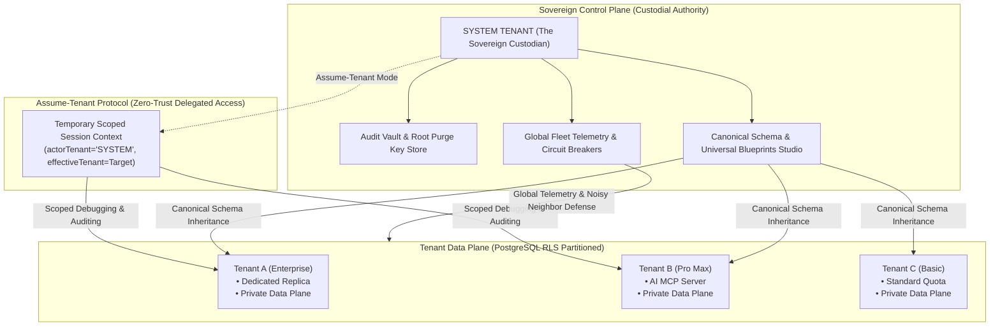
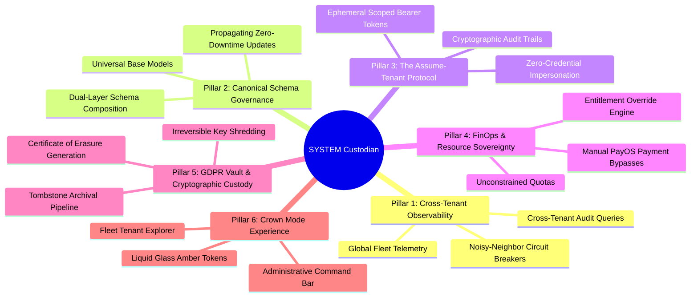
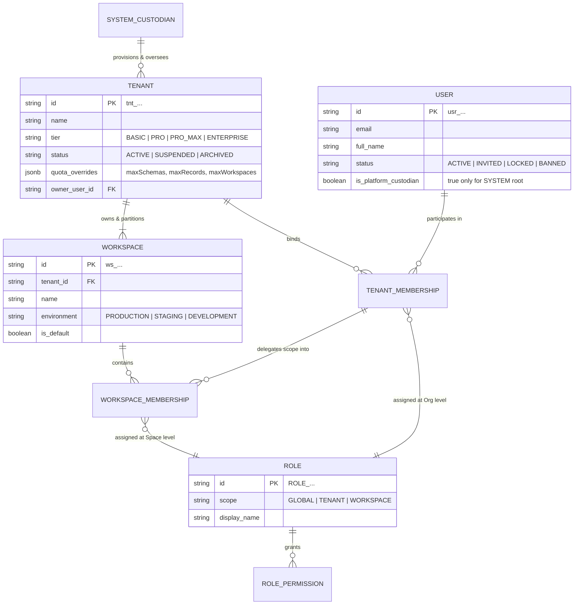
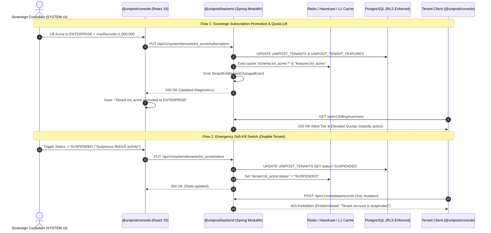

# Architectural Analysis & Specification: SYSTEM Tenant (Sovereign Root Custodian)

**Document Reference:** `docs/multi-tenants/11_system_tenant_sovereign_custody_architecture.md`  
**Series:** Multi-Tenant Architecture & Data Sovereignty Specification  
**Classification:** Canonical Architecture & System Blueprint  
**Target Systems:** `@unipost/backend` (Spring Modulith / Java 21 / PostgreSQL 16+), `@unipost/console` (React 19 / Vite 8 / TanStack Router)  
**Author:** Lead Systems Architect & Sovereign Custodian  
**Status:** Living Design Specification & Implementation Blueprint  

---

## 1. Executive Summary & Foundational Paradigm

In the Unipost SaaS multi-tenant ecosystem, the **`SYSTEM` Tenant** is fundamentally distinct from commercial tenant organizations. `SYSTEM` represents the **Sovereign Root Custodian**—the platform architect, root operator, and ultimate custodial authority of the entire ecosystem.



### 1.1 Commercial Tenants vs. The Sovereign Custodian

1. **Commercial Tenants (`tnt_...`)**:
   - Strictly bounded within isolated transactional perimeters enforced by PostgreSQL Row-Level Security (RLS) and cryptographic JSON Web Token (JWT) claims.
   - Constrained by plan quotas (`workspaces`, `schemas`, `records`, rate limits).
   - Consume and inherit base canonical schemas established by `SYSTEM`, but are strictly barred from modifying or deleting core system structures.

2. **The Sovereign Custodian (`SYSTEM`)**:
   - The universal root anchor across database schemas, authorization fabrics, cache partitions, and audit vaults.
   - Holds unconstrained resource quotas ($\infty$) and universal feature entitlements.
   - Commands absolute custodial authority: the ability to define canonical schemas, audit any tenant via zero-trust impersonation protocols, enforce global resource governance, issue cryptographic Certificates of Erasure, and safeguard platform operational continuity.

---

## 2. Codebase Audit: Current State & Critical Friction Points

An in-depth code audit across `unipost-fw`, `unipost-db`, and `@unipost/console` reveals existing foundations alongside several critical friction points and architectural paradoxes:

| Architectural Plane | Current Codebase Implementation | Critical Friction Point & Paradox |
|---|---|---|
| **PostgreSQL RLS Policies**<br/>(`changelog-00005.xml`) | `USING (tenant_id = current_tenant OR tenant_id = 'SYSTEM')`<br/>`WITH CHECK (tenant_id = current_tenant AND tenant_id != 'SYSTEM')` | ⚠️ **The RLS Write Paradox**: When an active session is authenticated as `current_tenant = 'SYSTEM'`, the constraint `tenant_id != 'SYSTEM'` evaluates to `FALSE`. Consequently, PostgreSQL RLS blocks the `SYSTEM` tenant itself from creating or modifying system attributes on an RLS-enabled connection. |
| **Data Plane Isolation**<br/>(`UNIPOST_ENTITIES`) | `USING (tenant_id = current_tenant)` | ⚠️ **Cross-Tenant Blindness**: When querying the data plane under `tenant_id = 'SYSTEM'`, PostgreSQL only returns records where `tenant_id` is explicitly `'SYSTEM'`. The custodian cannot run cross-tenant administrative audits or diagnostics at the SQL level without explicitly bypassing RLS. |
| **Metadata Authorization**<br/>(`MetadataService.java`) | `if ("SYSTEM".equalsIgnoreCase(attr.getTenantId())) throw MetadataConflictException(...)` | ⚠️ **Unconditional Mutation Lockout**: The method guards check only the target attribute's owner (`attr.tenantId == 'SYSTEM'`) without inspecting the caller's identity. Thus, even a Root Custodian authenticated as `SYSTEM` is blocked from updating or deleting system attributes via the REST API. |
| **Feature Entitlement**<br/>(`DefaultTenantEntitlementService.java`) | `if ("SYSTEM".equalsIgnoreCase(tenantId)) return true;` | ✅ **Correct**: `SYSTEM` is automatically granted 100% of all feature entitlements across tiers (`FEATURE_AI_AGENT_MCP`, `FEATURE_DEDICATED_REPLICA`, `FEATURE_ENTERPRISE_SLA`, etc.). |
| **Console UI & Sandbox**<br/>(`sandbox-store.ts`) | Predefined personas: `admin`, `creator`, `user`, `custom`. `admin` defaults to `tenant-us-east-1`. | ⚠️ **Missing Sovereign Persona**: There is no dedicated `system_root` persona with `activeTenantId: 'SYSTEM'` to activate custodial management consoles, fleet monitors, and God-mode navigation. |

---

## 3. The Six Pillars of Custodial Authority



### Pillar I: Global Cross-Tenant Observability & Fleet Defense

The Sovereign Custodian requires comprehensive telemetry across all provisioned tenants without violating operational isolation:
1. **Fleet Resource Telemetry**: Continuous real-time metrics across all tenants (storage footprints, record counts, active schema drift, token-bucket consumption rates, and HTTP 429 spike patterns).
2. **Noisy-Neighbor Circuit Breakers**: Granular authority to dynamically throttle, quarantine, or isolate any single runaway tenant whose unindexed queries, pathological regular expressions, or request volume threaten connection pools or database stability.
3. **Cross-Tenant Audit Logging**: Centralized, immutable ledger tracking administrative mutations across all tenant spaces.

### Pillar II: Canonical Schema Governance & Dual-Layer Inheritance

System-level metadata serves as the foundational DNA for all commercial organizations:
1. **Universal Base Models**: Standardized business entities (e.g., `Customer`, `Order`, `Invoice`, `MediaAsset`) defined and governed exclusively by `SYSTEM`.
2. **Dual-Layer Dynamic Composition**:
   $$\text{Effective Schema} = \text{Base SYSTEM Schema} \cup \text{Tenant Overlay Custom Attributes}$$
3. **Propagating Zero-Downtime Evolution**: When `SYSTEM` updates a canonical definition (e.g., adding an optional `kyc_verification_status` to `Customer`), all existing tenants instantly inherit the field through the composite cache fabric (`schema:{tid}:{entity}:v{tVer}_s{sVer}`) without requiring bespoke database schema migrations.

### Pillar III: The "Assume-Tenant" Protocol (Zero-Credential Impersonation)

To diagnose edge-case bugs, inspect data anomalies, or provide white-glove enterprise support:
1. **Zero Credential Exposure**: The Custodian never requests or reuses customer passwords or secrets.
2. **Dual-Context Security Principal**: The application establishes an impersonation session:
   - `actorTenantId = "SYSTEM"` (The authoritative initiator)
   - `effectiveTenantId = "tnt_target_org"` (The bounded execution scope)
3. **Cryptographically Sealed Audit Trail**: Every SQL execution, mutation, and read executed during an assumed session records both the actor and target in the tamper-evident audit ledger:
   ```json
   {
     "event": "RECORD_UPDATE",
     "actor": "system_root@unipost.io",
     "actorTenant": "SYSTEM",
     "impersonatedTenant": "tenant-acme-corp",
     "timestamp": "2026-10-10T21:45:00Z",
     "action": "MUTATION_RECORD_PATCH",
     "targetEntity": "ent_customer_acc_01"
   }
   ```

### Pillar IV: FinOps, Entitlement, & Resource Sovereignty

`SYSTEM` stands outside standard billing constraints while maintaining total stewardship over commercial boundaries and quota topologies:

1. **Subscription-Tiered Workspaces & System-Determined Data Quotas**:
   - **Workspace Quotas (Plan-Governed & Configurable)**:
     The maximum number of workspaces allocated to a tenant is fundamentally driven by their commercial subscription tier (`BASIC` = 1, `PRO` = 5, `PRO_MAX` = 15, `ENTERPRISE` = custom/unlimited). These thresholds are centrally configurable in the platform catalog by `SYSTEM`.
   - **Schema & Record Quotas (Sovereign Custodian Authority)**:
     Unlike workspace counts which tie to commercial packaging, data volume limits (`maxSchemas`, `maxRecords`) directly impact shared database buffer pools, disk I/O, and multi-tenant noisy-neighbor health. Therefore, while subscription tiers define baseline limits (e.g. Basic = 5 schemas), **the `SYSTEM` Sovereign Custodian holds sole, decisive authority** to configure, override, grant exceptions, or set custom thresholds on `maxSchemas` and `maxRecords` per tenant or globally.
2. **Unconstrained Custodian Quotas**:
   - For `SYSTEM` itself: `maxWorkspaces = -1`, `maxSchemas = -1`, `maxRecords = -1` (unlimited).
   - Token-bucket rate limits and Statement Timeouts (`3000ms`) are automatically bypassed or elevated for `SYSTEM` administrative operations.
3. **Manual Entitlement Overrides**: Authority to manually promote, downgrade, or extend subscriptions (`BASIC`, `PRO`, `PRO_MAX`, `ENTERPRISE`) independently of third-party payment rails (payOS VietQR), supporting custom enterprise SLAs, strategic pilots, and off-platform contracts.
4. **Dynamic Feature Provisioning**: Immediate manual toggling of protected platform feature flags (`FEATURE_AI_AGENT_MCP`, `FEATURE_DEDICATED_REPLICA`, `FEATURE_SSO_SAML`).

### Pillar V: GDPR Vault, Hard-Purge, & Cryptographic Custody

As the final custodian of legal compliance and data sanitization:
1. **Right to Be Forgotten Custodian (GDPR Art. 17 / SOC 2)**: Only `SYSTEM` can authorize and execute the irreversible 5-stage micro-batch hard-purge pipeline.
2. **Cryptographic Certificate of Erasure**: Upon completion of a purge, `SYSTEM` issues an immutable, digitally signed receipt detailing shredded tables, purged cache keys, and deleted S3 objects.
3. **System Protection Safeguard**: Strict invariants within the purge engine guaranteeing that records with `tenant_id = 'SYSTEM'` can **never** be targeted or destroyed by any purge pipeline.

### Pillar VI: Crown Mode UI Experience for the Custodian

When authenticating as `SYSTEM`, `@unipost/console` transitions to **Crown Mode**:
1. **Visual Demarcation**:
   - Navigation header displays the **Sovereign Custodian Badge** rendered with Liquid Glass Amber tokens (`amber-500/15`, specular highlight `shadow-[inset_0_1px_1px_rgba(245,158,11,0.4)]`).
   - Distinctive UI treatment guarantees immediate visual awareness of elevated privileges.
2. **Fleet Tenant Explorer**:
   - The workspace/tenant switcher transforms into a searchable, filterable Global Fleet Directory.
   - Enables one-click context transitions into any organization via the Assume-Tenant Protocol.
3. **Dedicated Custodial Command Views**:
   - Fleet Health & Noisy-Neighbor Monitor.
   - Universal Blueprint & Canonical Schema Studio.
   - Master Billing Ledger & Manual Entitlement Provisioner.
   - GDPR Certificate of Erasure Vault.

---

## 4. Technical Architecture & Implementation Blueprint

```
┌────────────────────────────────────────────────────────────────────────────────────────┐
│                        SOVEREIGN CUSTODIAN REFACTORING MATRIX                          │
├───────────────────────┬──────────────────────────────────┬─────────────────────────────┤
│ Architectural Layer   │ Target File / Module             │ Architectural Modification  │
├───────────────────────┼──────────────────────────────────┼─────────────────────────────┤
│ Database RLS Engine   │ `unipost-db/changelog-00005.xml` │ Fix RLS WITH CHECK paradox; │
│                       │                                  │ Grant SYSTEM bypass on both │
│                       │                                  │ metadata and data planes.   │
├───────────────────────┼──────────────────────────────────┼─────────────────────────────┤
│ Tenancy Framework     │ `TenantContextHolder.java`       │ Support `actorTenantId` vs  │
│                       │                                  │ `effectiveTenantId`.        │
├───────────────────────┼──────────────────────────────────┼─────────────────────────────┤
│ Database Aspect       │ `TenantSessionAspect.java`       │ Set `app.is_system_custodian│
│                       │                                  │ session variable in Postgres│
├───────────────────────┼──────────────────────────────────┼─────────────────────────────┤
│ Metadata Service      │ `MetadataService.java`           │ Permit SYSTEM caller to     │
│                       │                                  │ modify/delete SYSTEM fields.│
├───────────────────────┼──────────────────────────────────┼─────────────────────────────┤
│ Unified Sandbox Store │ `sandbox-store.ts`               │ Register `system` persona   │
│                       │                                  │ with `tenantId: 'SYSTEM'`.  │
├───────────────────────┼──────────────────────────────────┼─────────────────────────────┤
│ Console Navigation    │ `sidebar-data.ts` & Header       │ Crown Mode Glass styling &  │
│                       │                                  │ Fleet Tenant Explorer.      │
└───────────────────────┴──────────────────────────────────┴─────────────────────────────┘
```

### 4.1 Database Layer: Resolving the PostgreSQL RLS Paradox

The current RLS policies must be updated to explicitly recognize when `app.current_tenant_id` is `'SYSTEM'`. When the session is identified as the Sovereign Custodian:
- **`USING` Clause**: Evaluates to `TRUE` for all records, permitting universal read access for audits.
- **`WITH CHECK` Clause**: Allows writing both system-level metadata (`tenant_id = 'SYSTEM'`) and tenant-specific records without triggering constraint violations.

#### Target PostgreSQL Migration Definition:
```sql
-- 1. Metadata Schema Entity Types Policy
DROP POLICY IF EXISTS tenant_isolation_entity_types ON UNIPOST_ENTITY_TYPES;
CREATE POLICY tenant_isolation_entity_types ON UNIPOST_ENTITY_TYPES
    FOR ALL
    USING (
        current_setting('app.current_tenant_id', true) = 'SYSTEM'
        OR tenant_id = NULLIF(current_setting('app.current_tenant_id', true), '')
        OR tenant_id = 'SYSTEM'
    )
    WITH CHECK (
        current_setting('app.current_tenant_id', true) = 'SYSTEM'
        OR (
            tenant_id = NULLIF(current_setting('app.current_tenant_id', true), '')
            AND tenant_id != 'SYSTEM'
        )
    );

-- 2. Metadata Attribute Definitions Policy
DROP POLICY IF EXISTS tenant_isolation_attribute_defs ON UNIPOST_ATTRIBUTE_DEFINITIONS;
CREATE POLICY tenant_isolation_attribute_defs ON UNIPOST_ATTRIBUTE_DEFINITIONS
    FOR ALL
    USING (
        current_setting('app.current_tenant_id', true) = 'SYSTEM'
        OR tenant_id = NULLIF(current_setting('app.current_tenant_id', true), '')
        OR tenant_id = 'SYSTEM'
    )
    WITH CHECK (
        current_setting('app.current_tenant_id', true) = 'SYSTEM'
        OR (
            tenant_id = NULLIF(current_setting('app.current_tenant_id', true), '')
            AND tenant_id != 'SYSTEM'
        )
    );

-- 3. Data Plane Entity Records Policy
DROP POLICY IF EXISTS tenant_isolation_entities ON UNIPOST_ENTITIES;
CREATE POLICY tenant_isolation_entities ON UNIPOST_ENTITIES
    FOR ALL
    USING (
        current_setting('app.current_tenant_id', true) = 'SYSTEM'
        OR tenant_id = NULLIF(current_setting('app.current_tenant_id', true), '')
    )
    WITH CHECK (
        current_setting('app.current_tenant_id', true) = 'SYSTEM'
        OR tenant_id = NULLIF(current_setting('app.current_tenant_id', true), '')
    );
```

### 4.2 Backend Layer: Metadata Guard Refactoring

In `apps/backend/unipost-fw/src/main/java/com/unipost/service/MetadataService.java`, the immutability guards must differentiate between an unauthorized commercial tenant attempting to alter base schemas versus the Sovereign Custodian managing core platform infrastructure:

```java
// BEFORE: Unconditional block preventing all callers from modifying SYSTEM attributes
if ("SYSTEM".equalsIgnoreCase(attr.getTenantId())) {
    throw new MetadataConflictException("System attributes (tenant_id = 'SYSTEM') are immutable and cannot be deleted by tenant admins");
}

// AFTER: Caller-aware guard granting full custodial authority to SYSTEM
String callerTenantId = TenantContextHolder.getTenantId();
boolean isSovereignCustodian = "SYSTEM".equalsIgnoreCase(callerTenantId);

if ("SYSTEM".equalsIgnoreCase(attr.getTenantId()) && !isSovereignCustodian) {
    throw new MetadataConflictException(
        "Security Violation: Canonical system attributes (tenant_id = 'SYSTEM') are protected and may only be modified by the SYSTEM Sovereign Custodian."
    );
}
```

### 4.3 Tenancy Context Enhancement: Dual-Context Principal

In `TenantContextHolder.java`, support dual-context identification to power the Assume-Tenant protocol:

```java
public final class TenantContextHolder {

    private static final ThreadLocal<String> EFFECTIVE_TENANT = new ThreadLocal<>();
    private static final ThreadLocal<String> ACTOR_TENANT = new ThreadLocal<>();

    public static void setContext(String effectiveTenantId, String actorTenantId) {
        EFFECTIVE_TENANT.set(effectiveTenantId);
        ACTOR_TENANT.set(actorTenantId != null ? actorTenantId : effectiveTenantId);
    }

    public static String getTenantId() {
        return EFFECTIVE_TENANT.get();
    }

    public static String getActorTenantId() {
        return ACTOR_TENANT.get();
    }

    public static boolean isImpersonating() {
        return !Objects.equals(EFFECTIVE_TENANT.get(), ACTOR_TENANT.get());
    }

    public static boolean isSovereignActor() {
        return "SYSTEM".equalsIgnoreCase(ACTOR_TENANT.get());
    }

    public static void clear() {
        EFFECTIVE_TENANT.remove();
        ACTOR_TENANT.remove();
    }
}
```

### 4.4 Console Sandbox Integration: Registering the Sovereign Persona

In `apps/console/src/core/sandbox/store/sandbox-store.ts`, add the official `system` persona to enable instant developer switching and testing of Crown Mode:

```typescript
export const DEFAULT_SANDBOX_PERSONAS: Record<SandboxPersonaId, SandboxPersona> = {
  system: {
    id: 'system',
    name: 'Sovereign Custodian (Me)',
    username: 'sovereign_root',
    roles: ['ROLE_USER', 'ROLE_ADMIN', 'ROLE_SYSTEM_CUSTODIAN'],
    defaultTenantId: 'SYSTEM',
    description: 'Ultimate custodial authority over all tenants, universal schemas, and platform infrastructure',
  },
  admin: {
    id: 'admin',
    name: 'Tenant Administrator',
    username: 'admin_bypass',
    roles: ['ROLE_USER', 'ROLE_ADMIN'],
    defaultTenantId: 'tenant-us-east-1',
    description: 'Full administrative access scoped strictly to tenant-us-east-1',
  },
  // ... other personas
};
```

---

## 5. Security Invariants & Non-Negotiable Directives

To preserve system stability, data isolation, and defense against privilege escalation, any implementation of the `SYSTEM` tenant must satisfy these invariants:

1. **Zero Client-Trust Header Injection**:
   Clients can never elevate to `SYSTEM` simply by passing HTTP headers like `X-Tenant-Id: SYSTEM`. Elevating to `SYSTEM` requires cryptographically verified JWT claims containing `ROLE_SYSTEM_CUSTODIAN` signed by the private platform key.
2. **Immutable System Protection**:
   The GDPR purge pipeline (`TenantPurgeService`) must abort with a fatal exception if invoked with `targetTenant = 'SYSTEM'`. Platform infrastructure cannot self-terminate.
3. **Complete Impersonation Auditability**:
   Every request executed under an assumed tenant session must explicitly log both `actorTenantId: "SYSTEM"` and `effectiveTenantId: "<target>"` in all application logs and MDC contexts.
4. **Idempotent Dual-Layer Versioning**:
   Any updates performed by `SYSTEM` to canonical schemas must atomically increment the system schema version token (`sVer`) to trigger immediate cache invalidation across all tenant nodes without restart.

---

## 6. Deep Dive & Architectural Analysis: Tenants, Users, & RBAC Governance

To realize the Sovereign Custodian's ultimate authority, the platform's organizational hierarchy, user directory, and authorization fabric must be modeled under a unified, hierarchical RBAC (Role-Based Access Control) architecture.



### 6.1 Tenants Management Plane (The Sovereign Fleet)

In multi-tenant SaaS architecture, a **Tenant** represents an independent legal, commercial, or operational entity (an Organization, Company, or Individual Account). Under the Sovereign Custodian, tenant governance consists of three core capabilities:

1. **Tenant Lifecycle States & State Machine**:
   - `ACTIVE`: Normal operational state. Users authenticate, CRUD records, query schemas within assigned limits.
   - `SUSPENDED (Soft Kill-Switch)`: Activated manually by `SYSTEM` (due to delinquent payment, security breach investigation, or abusive resource consumption). In this state, read-only mode is enforced across all APIs; mutations, webhook dispatches, and background workers are rejected with `HTTP 403 Tenant Suspended`.
   - `ARCHIVED / TOMBSTONE`: All workspaces dismounted; tenant metadata marked with soft-delete timestamp.
   - `PURGED`: Permanently shredded via the GDPR Article 17 cryptographic purge pipeline, producing a digitally signed Certificate of Erasure.
2. **Dynamic Quota & Resource Exception Matrix**:
   - Every tenant inherits default resource ceilings based on their commercial subscription plan:
     - `BASIC`: 1 Workspace, 5 Schemas (default), 1,000 Records (default).
     - `PRO`: 5 Workspaces, Unlimited Schemas, 50,000 Records (default).
     - `PRO_MAX`: 15 Workspaces, Unlimited Schemas, 500,000 Records (default).
     - `ENTERPRISE`: Custom Workspaces, Unlimited Schemas, Unlimited Records.
   - **Sovereign Override Engine (`UNIPOST_TENANTS.quota_overrides`)**:
     The `SYSTEM` Custodian can inject runtime overrides directly into any tenant record:
     ```json
     {
       "tenant_id": "tenant-logistics-corp",
       "tier": "PRO",
       "quota_overrides": {
         "maxWorkspaces": 8,
         "maxSchemas": -1,
         "maxRecords": 250000,
         "rateLimitBurst": 1000,
         "rateLimitReplenishRate": 200
       },
       "override_justification": "Approved enterprise POC expansion by Sovereign Custodian",
       "updated_by": "SYSTEM"
     }
     ```
3. **Dedicated Fleet Operations & Bulk Dispatch**:
   - Broadcast global maintenance notifications directly into tenant alert feeds.
   - Force-evict tenant cache clusters upon major database migrations.
   - Isolate high-load enterprise tenants to dedicated read replicas with zero downtime.

---

### 6.2 Users Management Plane (Global Identities vs. Scoped Memberships)

A common pitfall in SaaS architectures is tightly coupling a user's physical account to a single tenant. Unipost adopts a **Global Universal Identity + Scoped Tenant Membership** model:

1. **Universal User Identity (`UNIPOST_USERS`)**:
   - A User exists once in the platform identity registry (`email`, `password_hash`, `mfa_secret`, `status`).
   - A single human user can belong to multiple tenants (e.g. an agency consultant managing 3 client workspaces, or a software engineer who has a personal developer workspace and belongs to an enterprise employer organization).
2. **Tenant Membership (`UNIPOST_TENANT_MEMBERSHIPS`)**:
   - Binds a `user_id` to a `tenant_id` with an assigned organizational role (e.g., `TENANT_ADMIN`, `TENANT_MEMBER`, `TENANT_VIEWER`).
   - Contains an invitation lifecycle (`INVITED` $\to$ `ACCEPTED` $\to$ `REVOKED`).
3. **Workspace Membership (`UNIPOST_WORKSPACE_MEMBERSHIPS`)**:
   - Grants access to specific environments (`ws_production`, `ws_staging`, `ws_sandbox`).
   - Prevents contractors or junior developers from touching production workspaces while allowing them full collaboration in staging environments.
4. **The `SYSTEM` Super-Identity**:
   - Flagged with `is_platform_custodian = true`.
   - Bypasses individual tenant membership checks; holds implicit global custodial membership across every tenant in the fleet.

---

### 6.3 Hierarchical RBAC: Roles & Granular Permissions Engine

Authorization in Unipost is partitioned into three distinct administrative tiers:

```
┌────────────────────────────────────────────────────────────────────────────────────────┐
│                          3-TIER HIERARCHICAL RBAC ARCHITECTURE                         │
├────────────────────────────────────────────────────────────────────────────────────────┤
│ TIER 1: GLOBAL PLATFORM ROLES (Sovereign Custody Level)                                │
│ • ROLE_SYSTEM_CUSTODIAN: Absolute master authority (The Root Custodian).              │
│ • ROLE_PLATFORM_OPERATOR: Read-only fleet observability, audit log inspector.         │
│ • ROLE_SUPPORT_ENGINEER: Permitted to initiate Assume-Tenant sessions with audit log.  │
├────────────────────────────────────────────────────────────────────────────────────────┤
│ TIER 2: TENANT / ORGANIZATION ROLES (Tenant-Scoped Governance)                        │
│ • ROLE_TENANT_OWNER: Primary billing contact; can invite admins, manage subscription.  │
│ • ROLE_TENANT_ADMIN: Full CRUD on schemas, blueprints, and workspace provisioning.    │
│ • ROLE_TENANT_MEMBER: Standard business user; manages records and operations.         │
│ • ROLE_TENANT_GUEST: Read-only access to published views and reports.                 │
├────────────────────────────────────────────────────────────────────────────────────────┤
│ TIER 3: WORKSPACE & FUNCTIONAL ROLES (Environment & Feature Scoped)                   │
│ • ROLE_SCHEMA_ARCHITECT: Access to Schema Studio, Dynamic Field Renderer, migrations.  │
│ • ROLE_DATA_OPERATOR: Access to Bento Grid records, import/export, transitions.       │
│ • ROLE_AI_DEVELOPER: Access to MCP Server config, LLM agent tool bindings.            │
└────────────────────────────────────────────────────────────────────────────────────────┘
```

#### Granular Permission Matrix (Standardized Permission Atoms)

All endpoint access and UI feature rendering evaluate against strict permission atoms:

| Permission Atom | Scope | Description | Granted By Default To |
|---|---|---|---|
| `platform:fleet:read` | Global | View global tenant directory, telemetry, noisy-neighbor metrics | `ROLE_SYSTEM_CUSTODIAN`, `ROLE_PLATFORM_OPERATOR` |
| `platform:fleet:mutate` | Global | Suspend/resume tenants, apply custom quota overrides | `ROLE_SYSTEM_CUSTODIAN` |
| `platform:assume_tenant` | Global | Initiate delegated Assume-Tenant impersonation sub-session | `ROLE_SYSTEM_CUSTODIAN`, `ROLE_SUPPORT_ENGINEER` |
| `platform:schemas:canonical` | Global | Author and publish universal canonical `SYSTEM` schemas | `ROLE_SYSTEM_CUSTODIAN` |
| `tenant:billing:write` | Tenant | Upgrade plan, configure VAT invoice, execute payOS checkout | `ROLE_SYSTEM_CUSTODIAN`, `ROLE_TENANT_OWNER` |
| `tenant:members:manage` | Tenant | Invite, remove, and assign roles to organizational users | `ROLE_SYSTEM_CUSTODIAN`, `ROLE_TENANT_OWNER`, `ROLE_TENANT_ADMIN` |
| `tenant:schemas:write` | Tenant | Create custom entity types, attributes, and relationships | `ROLE_SYSTEM_CUSTODIAN`, `ROLE_TENANT_ADMIN`, `ROLE_SCHEMA_ARCHITECT` |
| `workspace:records:write` | Workspace | Create, update, transition, and soft-delete entity records | `ROLE_SYSTEM_CUSTODIAN`, `ROLE_TENANT_MEMBER`, `ROLE_DATA_OPERATOR` |
| `workspace:records:export` | Workspace | Trigger non-blocking streaming ZIP/CSV data export | `ROLE_SYSTEM_CUSTODIAN`, `ROLE_TENANT_ADMIN`, `ROLE_DATA_OPERATOR` |

---

### 6.4 API Endpoints Architecture for Sovereign Fleet Governance

To support this governance model, the backend introduces the `/api/v1/system` control plane, protected strictly by `@PreAuthorize("hasAuthority('ROLE_SYSTEM_CUSTODIAN')")`:

```
# Tenant Governance
GET    /api/v1/system/tenants              -> PageResponse<FleetTenantSummaryDto>
GET    /api/v1/system/tenants/{id}         -> DetailedTenantFleetDiagnosticsDto
PUT    /api/v1/system/tenants/{id}/status  -> Suspend, activate, or archive tenant
PUT    /api/v1/system/tenants/{id}/quotas  -> Inject custom quota overrides (workspaces, schemas, records)
POST   /api/v1/system/tenants/{id}/assume  -> Issue ephemeral Assume-Tenant sub-session token

# Identity & Cross-Tenant User Governance
GET    /api/v1/system/users                -> PageResponse<GlobalUserListItemDto>
PUT    /api/v1/system/users/{id}/lock      -> Emergency lock compromised credential
GET    /api/v1/system/audit-logs           -> Universal tamper-evident audit ledger stream
```

---

## 7. Console UI/UX Architecture: Sovereign Crown Mode & Custodial Views

While the backend establishes the multi-tenant security boundary and cryptographic control plane, the frontend (`@unipost/console`) is the physical cockpit through which the Sovereign Custodian commands the platform.

```
┌────────────────────────────────────────────────────────────────────────────────────────┐
│                        SOVEREIGN CUSTODIAN CONSOLE SHELL ARCHITECTURE                   │
├────────────────────────────────────────────────────────────────────────────────────────┤
│ TOP BAR: CROWN BANNER & CONTEXT SWITCHER                                               │
│ [👑 Sovereign Custodian (SYSTEM)]  [Fleet Quick-Switcher (Cmd+K)]  [Audit Vault Lock]  │
├───────────────────────────────┬────────────────────────────────────────────────────────┤
│ SOVEREIGN FROSTED RAIL        │ MAIN CUSTODIAL VIEWPORT                                │
│ • Fleet Overview              │ (Dynamic Liquid Glass Canvas)                          │
│ • Tenants Directory           │ • Live Multi-Tenant Bento Health Telemetry             │
│ • Sovereign Users & RBAC      │ • Noisy-Neighbor CPU / Rate-Limit Heatmaps             │
│ • Quota Exception Matrix      │ • Instant "Assume-Tenant" Delegated Session Trigger     │
│ • Canonical Schema Studio     │ • Dual-Layer Canonical Schema Visualizer (SVG DAG)     │
│ • Platform Purge Vault        │ • Cryptographic Certificate of Erasure Generator       │
└───────────────────────────────┴────────────────────────────────────────────────────────┘
```

### 7.1 Visual Paradigm: Liquid Glass "Crown Mode" Tokens

To prevent accidental destructive operations and maintain instant situational awareness, the console dynamically shifts aesthetic tokens when authenticated as `tenant_id === 'SYSTEM'`:

1. **Aesthetic Tokens & Palette (OKLCH)**:
   - **Amber Sovereign Scrim**: Translucent tinted golden glass `bg-amber-500/10 dark:bg-amber-950/20` replaces the standard neutral white/slate backdrop.
   - **Specular Golden Rim**: Specular highlight borders `border-amber-400/40 dark:border-amber-500/25` with top-edge inset reflections:
     ```css
     box-shadow: inset 0 1px 1px 0 rgba(245, 158, 11, 0.45), 0 8px 32px 0 rgba(0, 0, 0, 0.37);
     ```
   - **Persistent Crown Status Pill**: A frosted golden pill badge anchored to the top navigation header:
     ```tsx
     <Badge className="bg-amber-500/20 text-amber-600 dark:text-amber-400 border border-amber-500/40 gap-1.5 px-2.5 py-1 text-xs font-bold tracking-wide uppercase">
       <Crown className="h-3.5 w-3.5 animate-pulse text-amber-500" />
       <span>Sovereign Root Custodian (SYSTEM)</span>
     </Badge>
     ```

2. **The "Assume-Tenant" Warning Banner (Session Masquerade Bar)**:
   When operating under an assumed tenant session (`actorTenantId: "SYSTEM"`, `effectiveTenantId: "tnt_acme"`), a persistent, high-visibility striped warning banner affixes to the top of the viewport:
   ```tsx
   <div className="sticky top-0 z-50 flex items-center justify-between px-4 py-1.5 bg-amber-500/90 text-amber-950 text-xs font-semibold backdrop-blur-md shadow-md">
     <div className="flex items-center gap-2">
       <ShieldAlert className="h-4 w-4" />
       <span>DELEGATED SESSION: You are currently inspecting <b>Acme International Corp (tenant-acme)</b> under Sovereign Custody.</span>
     </div>
     <Button size="xs" variant="outline" onClick={exitImpersonation} className="bg-amber-950 text-amber-100 border-none hover:bg-black">
       Exit Assume-Tenant Mode
     </Button>
   </div>
   ```

---

### 7.2 Core Custodial Screen Blueprints (`src/routes/_authenticated/system/*`)

The console introduces a dedicated top-level route tree: `/system`:

```
src/routes/_authenticated/system/
├── route.tsx                           # Custodial Shell Guard (ROLE_SYSTEM_CUSTODIAN required)
├── index.tsx                           # Path: "/system" -> Fleet Overview & Platform Health
├── tenants/
│   ├── index.tsx                       # Path: "/system/tenants" -> Fleet Tenant Directory & Search
│   └── $tenantId.tsx                   # Path: "/system/tenants/:id" -> Tenant Deep Diagnostic & Quotas
├── users/
│   ├── index.tsx                       # Path: "/system/users" -> Global Identity & Cross-Tenant Directory
│   └── roles.tsx                       # Path: "/system/users/roles" -> Platform RBAC & Permission Matrix
├── schemas/
│   └── canonical.tsx                   # Path: "/system/schemas/canonical" -> Universal Base Schema Studio
├── quotas/
│   └── index.tsx                       # Path: "/system/quotas" -> Quota Exception & Buffer Pool Ledger
└── vault/
    └── purge.tsx                       # Path: "/system/vault/purge" -> GDPR Purge Execution & Certificate Vault
```

#### Blueprint 1: Fleet Overview & Noisy-Neighbor Telemetry (`/system`)
- **Bento Metric Grid**:
  - Total Active Tenants vs. Suspended Tenants.
  - Global Storage Volume across S3 & PostgreSQL.
  - Active Database Connection Pool Saturation (`HikariCP Active / Idle / Wait`).
  - Real-Time ReDoS & Rate-Limit Spikes (HTTP 429 heatmaps).
- **Noisy-Neighbor Circuit Breaker Panel**:
  - Lists top 5 tenants consuming disproportionate CPU/IOPS.
  - One-click "Apply Emergency Statement Timeout (1000ms)" or "Throttle Tenant (HTTP 429)".

#### Blueprint 2: Fleet Tenants Directory & Assume-Tenant Hub (`/system/tenants`)
- **Interactive Tenant Ledger**:
  - Searchable by Tenant ID, Organization Name, Primary Admin Email, and Subscription Tier.
  - Visual status chips (`ACTIVE`, `SUSPENDED`, `ARCHIVED`).
- **One-Click Actions per Tenant**:
  - `Assume Context`: Launches the zero-trust Assume-Tenant sub-session, navigating directly to the tenant's workspace while recording the audit trail.
  - `Override Quotas`: Opens the Sovereign Quota Injection Drawer.
  - `Suspend / Resume`: Instant toggle for soft kill-switch.
  - `Trigger Streaming Export`: Downloads tenant data archive on behalf of compliance.

#### Blueprint 3: Sovereign Quota & Resource Configuration Drawer (`/system/tenants/:id`)
- **Configurable Workspace Ceilings**:
  - Plan-governed selector with custom override toggle.
- **System-Determined Data Quotas**:
  - `Max Entity Schemas`: Slider or numeric input with an **Unlimited ($\infty$)** checkbox.
  - `Max Records`: Numeric cap with automatic buffer pool impact calculator.
  - `Rate Limit Burst & Replenish Rate`: Custom token-bucket dials.
  - `Audit Justification Field` (mandatory): Documents why an exception was granted before submitting.

#### Blueprint 4: Global Users & Role-Based Access Control (`/system/users`)
- **Universal User Directory**:
  - Cross-tenant user search. Inspect which organizations a single email address belongs to.
  - Emergency Credential Revocation: Instant session termination across all devices for compromised accounts.
- **RBAC Matrix Editor**:
  - Visual matrix mapping permission atoms (`platform:fleet:read`, `tenant:schemas:write`) to custom roles.
  - Real-time inheritance visualizer showing effective permissions for any selected user across global, organizational, and workspace tiers.

#### Blueprint 5: Universal Canonical Schema Studio (`/system/schemas/canonical`)
- **Base Model Designer**:
  - Author and refine `SYSTEM` entity definitions (`Customer`, `Shipment`, `Invoice`).
  - Lock core fields: Mark specific attributes as immutable, mandatory, or indexed.
- **Inheritance Impact Analyzer**:
  - Before publishing a change to a base schema, the engine calculates:
    - How many active tenants currently inherit this model.
    - Potential collision detection with existing tenant overlay attributes.
  - One-click atomic publish with automatic `sVer` increment and Redis/Hazelcast cache eviction.

---

### 7.3 Navigation & Profile Switcher Integration

1. **`ProfileSwitcher` & `sidebarTeams` Evolution**:
   When logged in as the Sovereign Custodian, the header workspace switcher displays a dedicated **Platform Level Section**:
   ```
   [👑 Sovereign Platform (SYSTEM)]  <-- Always anchored at top
   ─────────────────────────────────
   Recent Tenants:
   • Acme International Corp (Production)
   • Global Logistics Fleet (Staging)
   • Clean Slate Workspace (Dev)
   ─────────────────────────────────
   [🔍 Browse All 48 Tenants... (Cmd+K)]
   ```

2. **Sidebar Navigation Rail (`sidebar-data.ts`)**:
   Under `ROLE_SYSTEM_CUSTODIAN`, the sidebar conditionally renders a new top-level group:
   - **`Sovereign Custody`** (Crown Icon):
     - `Fleet Overview` (`/system`)
     - `Tenants Directory` (`/system/tenants`)
     - `Global Users & RBAC` (`/system/users`)
     - `Canonical Schemas` (`/system/schemas/canonical`)
     - `Audit & Purge Vault` (`/system/vault/purge`)

3. **Living Specs Synchronization**:
   - `ROUTE.md`: Appends the `/system/*` route group, file locations, layout requirements, and permission guards.
   - `DESIGN.md`: Documents the Amber Liquid Glass tokens (`--glass-amber-bg`, `--glass-amber-border`, `--glass-amber-specular`) and Crown status badges.

This establishes an end-to-end operational cockpit, uniting backend cryptographic boundaries with an empowering, safety-hardened user interface for the Sovereign Custodian.

---

## 8. Dedicated UI Cockpits, API Wiring, & Full-Stack Behavior Synchronization

To translate custodial authority into a seamless operational toolchain, this section specifies the dedicated UI cockpits for **Fleet Tenants Management** and **RBAC Matrix Governance**, maps their exact **API Wiring Contracts**, and formalizes the **Full-Stack State Synchronization** mechanisms (Cache invalidation, WebSocket push, and Sandbox fallback).



---

### 8.1 Dedicated UI Cockpit: Fleet Tenants Management (`/system/tenants`)

The Fleet Tenants Management cockpit is purpose-built for comprehensive lifecycle control and resource tuning.

```
┌────────────────────────────────────────────────────────────────────────────────────────┐
│ FLEET TENANTS DIRECTORY & COMMAND COCKPIT (`/system/tenants`)                          │
├────────────────────────────────────────────────────────────────────────────────────────┤
│ [Search Tenant ID, Org, Domain... (Ctrl+K)]   [Filter: All Tiers ▼]  [Status: All ▼]   │
│ [+ Provision New Tenant]   [Batch Actions ▼]   [⚡ Emergency Kill-Switch]               │
├───────────────┬────────────┬─────────────┬─────────────────┬──────────────┬────────────┤
│ Tenant / Org  │ Plan Tier  │ Status      │ Resource Quotas │ Telemetry    │ Quick Act. │
├───────────────┼────────────┼─────────────┼─────────────────┼──────────────┼────────────┤
│ Acme Corp     │ PRO_MAX    │ ● ACTIVE    │ WS: 12/15       │ CPU: 12%     │ [⋮ More]   │
│ `tnt_acme`    │ Monthly    │ (payOS)     │ Rec: 42k/500k   │ Storage: 4GB │ • Assume   │
│               │            │             │ Schemas: 18/∞   │ 429 Spikes: 0│ • Lift Sub │
├───────────────┼────────────┼─────────────┼─────────────────┼──────────────┼────────────┤
│ QuickLogistics│ BASIC      │ ⏸ SUSPENDED │ WS: 1/1         │ CPU: 89% ⚠️  │ [⋮ More]   │
│ `tnt_log_01`  │ Free       │ By SYSTEM   │ Rec: 1.2k/1k ⚠️ │ 429 Spikes:84│ • Resume   │
│               │            │             │ Schemas: 5/5    │ Statement:TO │ • Edit Qta │
└───────────────┴────────────┴─────────────┴─────────────────┴──────────────┴────────────┘
```

#### Core UI Capabilities & Modals:

1. **Provision New Tenant Modal (`<CreateTenantModal />`)**:
   - Fields: Organization Name, Subdomain / Slug, Primary Owner Email, Initial Tier (`BASIC`, `PRO`, `PRO_MAX`, `ENTERPRISE`), Blueprint Template selector (`Blank`, `Headless CMS`, `B2B CRM`).
   - Action: Submits `POST /api/v1/system/tenants` $\to$ automatically triggers `TenantProvisioningService` $\to$ seeds blueprint $\to$ generates owner activation link.
2. **Subscription Lift & Downscale Drawer (`<SubscriptionOverrideDrawer />`)**:
   - Allows the Custodian to manually override any tenant's commercial tier:
     - **Promote**: Instantly elevate `BASIC` $\to$ `ENTERPRISE` without payment gateway processing (e.g. for enterprise pilots, sponsorship, strategic partners).
     - **Downscale**: Gracefully step down or schedule expiration.
     - **Feature Flags Cherry-Picker**: Independent toggles for individual flags (`FEATURE_AI_AGENT_MCP`, `FEATURE_DEDICATED_REPLICA`, `FEATURE_SSO_SAML`).
     - **Effective Expiry Picker**: Set explicit end-date or toggle **Perpetual ($\infty$)**.
3. **Emergency Soft-Kill Switch Modal (`<SuspendTenantDialog />`)**:
   - Instantly transitions tenant state between `ACTIVE` and `SUSPENDED`.
   - Requires mandatory **Suspension Reason** (e.g., `Payment Delinquency`, `Abusive Regex Attack / ReDoS`, `Security Incident`).
   - Displays real-time active user sessions count that will be evicted upon confirmation.
4. **Sovereign Quota Injection Slider (`<QuotaTuningDrawer />`)**:
   - **Workspaces Ceiling**: Discrete slider matching plan baseline with custom override lock.
   - **Max Schemas**: Custom numeric input with **Unlimited ($\infty$)** toggle.
   - **Max Records**: Scale slider up to $10,000,000$ records with dynamic memory impact gauge.
   - **Rate Limiting Tokens**: Configure per-tenant token-bucket `burst` ($100 - 5000$) and `replenishRate` ($10 - 1000$ req/sec).

---

### 8.2 Dedicated UI Cockpit: RBAC & Permission Matrix (`/system/users/roles`)

A dedicated visual management suite for hierarchical roles and fine-grained permissions.

```
┌────────────────────────────────────────────────────────────────────────────────────────┐
│ SOVEREIGN RBAC & PERMISSION MATRIX STUDIO (`/system/users/roles`)                       │
├────────────────────────────────────────────────────────────────────────────────────────┤
│ [Search Permissions...]  [Filter Scope: ALL ▼]   [+ Define Custom Role]  [Export JSON] │
├─────────────────────────┬───────────┬───────────────┬──────────────┬───────────────────┤
│ Permission Atom         │ Category  │ SYSTEM_CUSTOD │ TENANT_ADMIN │ DATA_OPERATOR     │
├─────────────────────────┼───────────┼───────────────┼──────────────┼───────────────────┤
│ `platform:fleet:read`   │ Platform  │     [✔ Locked]│     [  --  ] │     [  --  ]      │
│ `platform:fleet:mutate` │ Platform  │     [✔ Locked]│     [  --  ] │     [  --  ]      │
│ `platform:assume_tenant`│ Platform  │     [✔ Locked]│     [  --  ] │     [  --  ]      │
│ `tenant:billing:write`  │ Tenant    │     [✔]       │     [✔]      │     [  --  ]      │
│ `tenant:schemas:write`  │ Metadata  │     [✔]       │     [✔]      │     [  --  ]      │
│ `workspace:records:read`│ Data      │     [✔]       │     [✔]      │     [✔]           │
│ `workspace:records:write│ Data      │     [✔]       │     [✔]      │     [✔]           │
│ `workspace:export:stream│ Data      │     [✔]       │     [✔]      │     [✔]           │
└─────────────────────────┴───────────┴───────────────┴──────────────┴───────────────────┘
```

#### Core RBAC UI Capabilities:

1. **Interactive Permission Matrix Grid (`<RbacMatrixGrid />`)**:
   - Rows: Categorized permission atoms (`Platform`, `Organization`, `Metadata Studio`, `Data Plane`, `Compliance`).
   - Columns: System roles and custom defined roles.
   - Cells: Interactive toggles with inheritance status (Directly Assigned, Inherited from Base Role, or System Locked).
2. **Role Creation & Inheritance Visualizer (`<RoleDefinitionModal />`)**:
   - Allows creating specialized operational roles (e.g. `DATA_COMPLIANCE_OFFICER`, `AI_WORKFLOW_AUDITOR`).
   - Displays SVG inheritance DAG showing how custom roles derive from `TENANT_MEMBER` or `TENANT_ADMIN`.
3. **Cross-Tenant User Inspector (`<UserMembershipDrawer />`)**:
   - Displays a global profile for any user (`usr_...`).
   - Shows a multi-tenant membership card list:
     ```
     [Acme Corp]       -> Role: TENANT_ADMIN  | Status: ACTIVE
     [Logistics Staging]-> Role: DATA_OPERATOR | Status: INVITED
     ```
   - Emergency **"Revoke All Sessions Globally"** button: instantly invalidates refresh tokens and broadcasts session termination across WebSocket channels.

---

### 8.3 Complete API Wiring Contract

All custodial interactions communicate over the dedicated `/api/v1/system` control plane.

| Method | Endpoint Path | Request Payload (DTO) | Response Body (DTO) | Spring PreAuthorize Guard |
|---|---|---|---|---|
| `GET` | `/api/v1/system/tenants` | `?page=1&size=20&query=&tier=&status=` | `PageResponse<FleetTenantSummaryDto>` | `hasAuthority('platform:fleet:read')` |
| `POST` | `/api/v1/system/tenants` | `CreateTenantRequest` | `FleetTenantSummaryDto` | `hasAuthority('platform:fleet:mutate')` |
| `GET` | `/api/v1/system/tenants/{id}` | *(None)* | `DetailedTenantFleetDiagnosticsDto` | `hasAuthority('platform:fleet:read')` |
| `PUT` | `/api/v1/system/tenants/{id}/status` | `UpdateTenantStatusRequest` (`status`, `reason`) | `FleetTenantSummaryDto` | `hasAuthority('platform:fleet:mutate')` |
| `PUT` | `/api/v1/system/tenants/{id}/subscription` | `OverrideSubscriptionRequest` (`planTier`, `features`, `expiresAt`, `reason`) | `TenantBillingSummaryDto` | `hasAuthority('platform:fleet:mutate')` |
| `PUT` | `/api/v1/system/tenants/{id}/quotas` | `UpdateTenantQuotasRequest` (`maxWorkspaces`, `maxSchemas`, `maxRecords`, `rateLimitBurst`, `reason`) | `QuotaUsageDto` | `hasAuthority('platform:fleet:mutate')` |
| `POST` | `/api/v1/system/tenants/{id}/assume` | `AssumeTenantRequest` (`durationMinutes`) | `AssumeTenantTokenResponse` (`ephemeralToken`, `expiresAt`) | `hasAuthority('platform:assume_tenant')` |
| `GET` | `/api/v1/system/roles` | *(None)* | `List<RoleWithPermissionsDto>` | `hasAuthority('platform:fleet:read')` |
| `PUT` | `/api/v1/system/roles/{id}/permissions` | `UpdateRolePermissionsRequest` (`permissionIds`) | `RoleWithPermissionsDto` | `hasAuthority('platform:fleet:mutate')` |
| `GET` | `/api/v1/system/users` | `?page=1&size=20&query=` | `PageResponse<GlobalUserListItemDto>` | `hasAuthority('platform:fleet:read')` |
| `PUT` | `/api/v1/system/users/{id}/lock` | `LockUserRequest` (`isLocked`, `reason`) | `GlobalUserListItemDto` | `hasAuthority('platform:fleet:mutate')` |

---

### 8.4 Full-Stack State Synchronization Invariants

When `SYSTEM` mutates fleet configurations, states must propagate instantly across caching layers, distributed workers, and client viewports without requiring application server restarts or tenant page reloads:

1. **Dual-Layer Cache Eviction Fabric**:
   - When `SYSTEM` executes `PUT /subscription` or `PUT /quotas` for `tnt_acme`:
     1. Database writes commit atomically inside a `@Transactional` block.
     2. `TenantEntitlementService.invalidateCache(tenantId)` clears the L1 `ConcurrentHashMap`.
     3. A Redis/Hazelcast pub/sub event (`topic:tenant:invalidated`, payload: `{ tenantId, event: 'ENTITLEMENTS_UPDATED' }`) broadcasts across all backend cluster nodes, evicting local L1 caches simultaneously.
2. **Dynamic UI Query Invalidation (TanStack Query)**:
   - Upon successful mutation in `@unipost/console`, the mutation hook triggers multi-key invalidations:
     ```typescript
     queryClient.invalidateQueries({ queryKey: ['system', 'tenants'] });
     queryClient.invalidateQueries({ queryKey: ['system', 'tenant', tenantId] });
     queryClient.invalidateQueries({ queryKey: ['billing-summary', tenantId] });
     queryClient.invalidateQueries({ queryKey: ['tenant-quotas', tenantId] });
     ```
3. **Unified Sandbox Parity & Zero-Network Mocking**:
   - In development mode or offline demonstrations, all `/api/v1/system/*` routes are fully mirrored inside `apps/console/src/core/sandbox/handlers/system-sandbox-handler.ts`.
   - The sandbox maintains a stateful in-memory `mockFleetStore` that responds to status toggles, quota lifts, and subscription promotions with identical latency and error envelopes, guaranteeing 100% development fidelity without a live backend connection.
